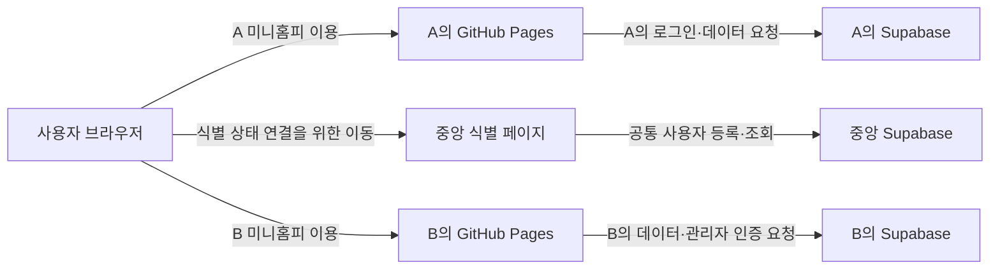

# 분산 미니홈피의 공통 방문자 식별 설계

이 문서는 서로 독립적으로 운영되는 미니홈피 사이에서 같은 방문자를 알아보기 위한 공통 식별 구조를 정의한다. 각 단계에서 합의한 요구사항과 설계 결정을 차례로 추가한다.

Step 1부터 Step 8까지 목표와 범위, 용어와 신뢰 경계, 시스템 구성, 브라우저 제약, 사용자 흐름, 식별 프로토콜, 예외 처리, 첫 시제품과 검증 계획을 정의했다. 이 문서는 초기 구현과 검수의 기준으로 사용한다.

## 배경

각 사용자는 자신의 GitHub Pages와 Supabase를 이용해 개인 미니홈피를 운영한다. 미니홈피 화면은 각자의 GitHub Pages에서 제공하고, 게시물·사진·방명록을 비롯한 개인 데이터와 계정은 각자의 Supabase에 둔다.

이 구조에서는 A가 자신의 미니홈피에 로그인해도 B의 미니홈피가 A를 같은 사용자로 바로 알아볼 수 없다. 서로 다른 사이트와 Supabase 프로젝트 사이에서 방문자 신원을 연결할 공통 기준이 없기 때문이다.

이를 해결하기 위해 중앙 Supabase를 하나 두되, 전체 미니홈피를 제공하거나 개인 콘텐츠를 모으는 중앙 애플리케이션으로 사용하지 않는다. 중앙 Supabase는 여러 미니홈피가 공유하는 최소한의 사용자 식별 기능만 담당한다.

## 목표

- 각 미니홈피의 호스팅, 데이터 저장소와 계정 로그인을 해당 사용자가 계속 독립적으로 운영한다.
- 한 미니홈피에서 식별된 사용자를 다른 사용자의 미니홈피에서도 같은 방문자로 알아본다.
- A가 자신의 계정으로 식별된 상태에서 B의 미니홈피를 방문하면 B가 현재 방문자를 A로 표시할 수 있게 한다.
- 미니홈피 사이의 링크로 이동한 경우 방문자의 식별 상태를 전달한다.
- 다른 미니홈피 주소를 직접 입력해 이동한 경우에도 중앙 식별 절차를 자동으로 수행한다.
- 사용자가 현재 방문 중인 미니홈피와 관계없이 자신의 미니홈피 계정으로 로그인할 수 있게 한다.
- 공통 방문자 식별과 각 미니홈피의 관리자 권한을 분리한다.

## 필요한 사용자 동작

### 로그인된 방문

A가 자신의 미니홈피에서 A의 Supabase 계정으로 로그인한 뒤 B의 미니홈피를 방문하면, B는 방문자를 A로 인식한다. 이때 B의 우측 상단에는 로그인된 방문자임을 나타내는 `로그아웃`을 표시한다.

A의 미니홈피에 있는 링크를 눌러 B로 이동한 경우에는 첫 방문부터 A를 알아봐야 한다. 주소창에 B의 주소를 직접 입력한 경우에도 방문자 식별을 기본으로 시도한다. 이를 위해 중앙 페이지를 잠시 거치면서 발생하는 주소 변경이나 화면 깜빡임은 허용한다.

방문자 식별을 시작하기 위한 별도의 `내 계정으로 방문` 버튼은 두지 않는다. 식별된 계정으로 방문하는 것이 기본 동작이다.

### 로그아웃 상태의 방문

중앙에서 확인할 방문자 식별 정보가 없는 상태로 B의 미니홈피에 접속하면 익명 방문자로 처리하고, 우측 상단에 `로그인`을 표시한다.

### 다른 미니홈피에서 로그인

B의 미니홈피에서 `로그인`을 선택한 사용자는 자신이 사용할 계정을 정할 수 있다. A의 계정을 선택해 A의 Supabase에서 로그인하면 B에 A로 돌아오고, B의 계정을 선택해 B의 Supabase에서 로그인하면 B로 돌아온다.

어느 미니홈피에서 로그인을 시작했는지는 사용할 수 있는 계정을 제한하지 않는다. 실제 계정 확인은 선택한 사용자의 Supabase에서 수행한다.

### 로그아웃

식별된 방문자가 `로그아웃`을 선택하면 이후 미니홈피에서 로그인된 방문자로 표시되지 않아야 한다. 초기 버전의 로그아웃은 중앙의 공통 방문자 상태를 종료하며, origin이 서로 다른 각 Supabase의 로컬 로그인 세션은 종료하지 않는다.

## 시스템 구성과 역할 분담

### 배치 원칙

개인 미니홈피의 제공과 데이터 관리는 계속 사용자별로 분산한다. 중앙 구성요소는 공통 사용자 ID와 브라우저의 방문자 식별 상태를 연결하는 일에만 참여한다. 한 사용자의 GitHub Pages나 Supabase가 다른 사용자의 콘텐츠를 대신 제공하거나 관리하지 않는다.

모든 미니홈피와 중앙 구성요소 사이의 통신은 초기 설계에서 브라우저가 시작한다. 중앙 시스템이 각 사용자의 Supabase 데이터베이스에 직접 접속하거나, 사용자별 Supabase끼리 서버 간 통신하는 구조를 전제로 하지 않는다.



이 그림의 연결은 논리적 역할을 나타낸다. 실제 요청 순서와 전달 값은 아래 사용자 흐름과 식별 정보 전달 설계에서 정의한다.

### 사용자별 GitHub Pages

각 GitHub Pages는 해당 사용자의 미니홈피 프런트엔드를 제공한다.

- 미니홈피의 HTML, CSS, JavaScript와 공개 설정을 배포한다.
- 현재 방문자의 공통 방문자 상태를 확인하는 절차를 시작한다.
- 식별 결과에 따라 `로그인` 또는 `로그아웃`을 표시한다.
- 식별된 방문자의 표시 이름과 공통 사용자 정보를 화면 기능에 이용한다.
- 현재 미니홈피의 Supabase에 공개 콘텐츠 조회와 허용된 데이터 작업을 요청한다.

GitHub Pages에는 서버 측 비밀 값을 둘 수 없다. 개인 Supabase와 중앙 시스템의 공개 URL 및 공개용 키만 프런트엔드 설정으로 사용할 수 있다. 방문자 식별 결과만으로 관리자 권한을 판정하지 않는다.

### 사용자별 Supabase

각 사용자의 Supabase는 해당 미니홈피의 계정, 데이터와 권한을 소유한다.

- 해당 사용자의 실제 로컬 계정 로그인을 처리한다.
- 게시물, 사진, 다이어리, 방명록, 댓글, 프로필과 설정을 저장한다.
- RLS와 데이터베이스 함수로 해당 미니홈피의 읽기·쓰기 권한을 판정한다.
- 현재 미니홈피 소유자의 관리자 인증을 최종 판정한다.

A의 Supabase가 발급한 세션은 A의 Supabase 안에서만 권한 근거로 사용한다. 중앙 시스템이나 B의 Supabase는 그 세션을 B의 인증 세션으로 바꾸지 않는다. 중앙 시스템도 각 사용자의 콘텐츠 테이블을 복제하거나 수정하지 않는다.

### 중앙 식별 페이지

중앙 식별 페이지는 브라우저가 최상위 페이지로 잠시 방문하는 공통 진입점이다. 이 페이지는 중앙 origin의 브라우저 저장소를 읽고 갱신하며, 식별 결과를 원래 미니홈피에 전달한 뒤 복귀시키는 역할을 맡는다.

- 방문자가 현재 어떤 공통 사용자로 식별되어 있는지 확인한다.
- 로그인 시작 지점과 로그인 완료 후 돌아갈 미니홈피를 연결한다.
- 식별된 상태 또는 익명 상태를 목적지 미니홈피에 전달한다.
- 전달이 끝나면 사용자를 원래 미니홈피로 돌려보낸다.

중앙 식별 페이지는 콘텐츠를 저장하거나 미니홈피 화면을 대신 제공하지 않는다. 초기 시제품에서는 중앙 Supabase의 공개 Edge Function이 HTML과 JavaScript를 제공한다. 여러 미니홈피가 같은 중앙 상태를 읽도록 이 함수의 안정된 단일 origin을 계속 사용한다.

### 중앙 Supabase

중앙 Supabase는 공통 방문자 식별에 필요한 영속 데이터를 소유한다.

- 여러 미니홈피에서 공통으로 사용할 사용자 ID를 관리한다.
- 공통 사용자 ID와 대표 미니홈피, 사용자별 Supabase 및 로그인 진입점의 연결 정보를 관리한다.
- 중앙 식별 페이지가 사용자 연결 정보를 등록하고 조회할 최소 API를 제공한다.
- 폐기되거나 유효하지 않은 사용자 연결을 구분한다.

중앙 Supabase에는 개인 미니홈피의 콘텐츠, 사용자별 비밀번호, 사용자별 Supabase 액세스 토큰과 관리자 세션을 저장하지 않는다. 방문 이력이나 소셜 기능 데이터도 초기 범위에 포함하지 않는다. 초기 테이블과 공개 범위는 아래 중앙 데이터 모델과 데이터 접근 경계에서 정의한다.

### 사용자 브라우저

브라우저는 독립된 시스템 사이에서 상태를 운반한다.

- 각 미니홈피 origin에는 그 미니홈피에서 사용하는 로컬 상태와 Supabase 세션이 저장될 수 있다.
- 중앙 식별 페이지 origin에는 현재 공통 방문자 상태가 저장될 수 있다.
- 페이지 이동 과정에서는 목적지와 복귀 위치, 식별 결과 같은 일시적인 값이 전달될 수 있다.

브라우저 안에 모든 값이 존재하더라도 서로 다른 origin이 상대방의 저장소를 직접 읽을 수 있는 것은 아니다. 저장소가 나뉘는 정확한 기준과 그로 인해 중앙 페이지 이동이 필요한 이유는 아래 브라우저 제약에서 다룬다.

### 데이터 소유권 요약

| 데이터 | 소유 위치 | 중앙 저장 여부 |
| --- | --- | --- |
| 미니홈피 정적 화면과 실행 코드 | 사용자별 GitHub Pages | 저장하지 않음 |
| 사용자별 실제 계정과 로컬 사용자 ID | 사용자별 Supabase | 연결에 필요한 최소 참조만 검토 |
| 게시물·사진·방명록·댓글·설정 | 사용자별 Supabase | 저장하지 않음 |
| 관리자 권한과 데이터 접근 정책 | 사용자별 Supabase | 저장하지 않음 |
| 공통 사용자 ID와 미니홈피 연결 정보 | 중앙 Supabase | 저장함 |
| 현재 브라우저의 공통 방문자 상태 | 중앙 origin의 `localStorage` | 별도 세션 레코드는 저장하지 않음 |
| 각 사이트의 로컬 세션 | 해당 origin의 브라우저 저장소와 해당 Supabase | 저장하지 않음 |

### 장애의 영향 범위

사용자별 구성요소의 장애는 해당 미니홈피 범위에 머무르는 것을 원칙으로 한다.

- A의 GitHub Pages 장애는 A의 미니홈피 제공에 영향을 주지만 B의 페이지 제공에는 영향을 주지 않는다.
- A의 Supabase 장애는 A의 로그인과 데이터 기능에 영향을 주지만 다른 사용자의 데이터베이스에는 영향을 주지 않는다.
- 중앙 식별 시스템 장애가 발생해도 각 미니홈피의 정적 화면과 공개 콘텐츠는 가능한 범위에서 익명 방문으로 계속 제공하는 것을 목표로 한다.
- 중앙 식별 시스템이 복구되면 개인 콘텐츠를 중앙에서 복원하거나 동기화할 필요 없이 방문자 식별만 다시 수행한다.

직접 방문 시 중앙 페이지로 자동 이동하는 요구사항은 중앙 장애 동안 페이지 진입을 지연시키거나 중단시킬 수 있다. 아래 예외 처리에서는 이동 전 상태 확인과 리다이렉트 가드로 이를 줄이며, 완전 중단 상황은 실제 브라우저에서 검증한다.

## 용어 정의

### 사용자와 미니홈피

**사용자**는 이 구조에 참여하여 공통 사용자 ID를 가진 사람이다. 한 사용자는 자신의 GitHub Pages 미니홈피와 Supabase 프로젝트를 운영한다. 초기 설계에서는 사용자 한 명과 대표 미니홈피 한 개의 연결을 기본으로 한다. 한 사람이 여러 미니홈피를 운영하거나 하나의 미니홈피를 여러 사람이 공동 관리하는 경우는 후속 확장 범위다.

**자기 미니홈피**는 사용자의 공통 사용자 정보에 연결된 대표 미니홈피다. A에게는 A의 GitHub Pages와 A의 Supabase가 자기 미니홈피를 구성한다.

**현재 미니홈피**는 브라우저에 지금 열려 있는 미니홈피다. A가 B를 방문하는 동안 자기 미니홈피는 A이고 현재 미니홈피는 B다. 로그인에 사용할 계정은 현재 미니홈피의 소유자로 제한되지 않는다.

**미니홈피 소유자**는 현재 미니홈피의 설정과 콘텐츠를 관리할 권한을 가진 사용자다. B의 미니홈피에서는 B가 소유자다.

### ID와 연결 정보

**로컬 사용자 ID**는 각 사용자의 Supabase Auth가 발급하는 사용자 ID다. 이 ID의 의미와 유효 범위는 발급한 Supabase 프로젝트 안으로 한정한다. 서로 다른 Supabase 프로젝트에서 우연히 같거나 다른 값을 갖는지와 관계없이 공통 신원으로 직접 사용하지 않는다.

**공통 사용자 ID**는 중앙 Supabase가 관리하며 모든 참여 미니홈피에서 같은 사용자를 가리키는 식별자다. A의 로컬 사용자 ID와 A의 공통 사용자 ID는 서로 다른 값일 수 있다. 중앙의 연결 정보가 둘의 관계를 나타낸다.

**사용자 연결 정보**는 공통 사용자 ID를 사용자의 대표 미니홈피, 해당 Supabase 프로젝트와 로그인 진입점에 연결하는 중앙 등록 정보다. 초기 필드는 아래 중앙 데이터 모델에서 정의하며, 신규 사용자 등록 절차는 후속 범위로 남긴다.

**방문자 식별표**는 현재 브라우저가 어떤 공통 사용자로 행동하는지를 미니홈피에 전달하기 위한 값이다. 초기 버전에서는 중앙 함수가 발급한 짧은 수명의 서버 서명 토큰을 사용한다. 정확한 종류와 수명은 식별 정보 전달 설계에서 정의한다.

### 상태와 권한

**로컬 로그인 세션**은 사용자가 특정 Supabase 프로젝트에서 실제로 로그인한 상태다. A의 Supabase가 만든 로컬 로그인 세션은 A의 계정을 확인하고 A 미니홈피의 관리자 권한을 판정하는 데 사용한다. B의 Supabase는 이 세션을 자신의 인증 세션으로 취급하지 않는다.

**공통 방문자 상태**는 중앙 식별 절차를 통해 브라우저가 특정 공통 사용자로 표시되는 상태다. A의 공통 방문자 상태를 가진 브라우저가 B에 도착하면 B는 방문자를 A로 표시할 수 있다. 이 상태를 사용자 화면에서는 로그인 상태로 표현하여 우측 상단에 `로그아웃`을 표시한다.

**식별된 방문자**는 유효한 공통 방문자 상태가 확인된 방문자다. 식별된 방문자는 어느 미니홈피에 있든 같은 공통 사용자 ID와 표시 정보를 사용한다.

**익명 방문자**는 확인할 공통 방문자 상태가 없는 방문자다. 익명 방문자에게는 우측 상단에 `로그인`을 표시한다.

**관리자 인증**은 현재 미니홈피의 Supabase가 로컬 로그인 세션과 권한 정보를 이용해 소유자 권한을 확인하는 절차다. 공통 방문자 상태와 독립적으로 판단한다.

## 신원과 세션의 관계

A가 B의 미니홈피에 방문했을 때 관련된 상태는 다음처럼 구분한다.

| 상태 | 확인 주체 | 의미 | 허용되는 용도 |
| --- | --- | --- | --- |
| A의 로컬 로그인 세션 | A의 Supabase | A의 프로젝트에서 로그인한 계정 | A의 계정 확인과 A 미니홈피 관리 |
| A의 공통 방문자 상태 | 중앙 식별 시스템 | 현재 브라우저를 공통 사용자 A로 표시 | B에서 A의 이름과 공통 ID 표시 |
| B의 관리자 인증 | B의 Supabase | 현재 사용자가 B의 관리자임을 확인 | B의 설정과 콘텐츠 관리 |

A의 공통 방문자 상태가 있다는 사실만으로 B의 Supabase에 로그인되는 것은 아니다. 따라서 B가 A를 식별된 방문자로 표시하는 것과 B의 데이터베이스가 A에게 `authenticated` 권한을 부여하는 것은 별개의 문제다.

B가 공통 사용자 ID를 댓글이나 방명록의 작성자 표시에 사용하는 것은 향후 설계할 수 있다. 그러나 현재 문서 범위에서는 공통 방문자 상태만으로 B의 Supabase 쓰기 권한이나 기존 `auth.uid()` 기반 소유권을 얻는다고 가정하지 않는다. 해당 기능이 필요하면 B의 데이터 저장 방식과 권한 정책을 별도로 설계해야 한다.

사용자 화면의 `로그인`과 `로그아웃`은 기본적으로 공통 방문자 상태를 가리킨다. 현재 미니홈피 소유자의 관리 기능에 들어갈 때는 별도로 관리자 인증을 확인한다. 두 상태를 하나의 버튼과 화면에서 어떻게 표현할지는 사용자 흐름 단계에서 정한다.

## 신뢰 수준

초기 버전의 목적은 방문자를 엄밀하게 인증하거나 신원을 법적·보안상 증명하는 것이 아니다. 서로 다른 미니홈피에서 같은 사용자를 일관된 이름과 ID로 알아보는 것이 목적이다. 따라서 방문자 식별 정보가 복사되거나 다른 사람이 특정 사용자를 흉내 내는 상황을 완전히 방지할 필요는 없다.

이 완화된 신뢰 수준은 방문자 표시와 교류 기능에만 적용한다. 게시물 관리, 설정 변경, 다른 사용자 글의 수정·삭제처럼 미니홈피 소유자 권한이 필요한 작업은 해당 미니홈피의 Supabase 인증과 권한 검사를 계속 사용한다. 공통 방문자 ID만으로 관리자 권한을 부여하지 않는다.

중앙 식별 시스템이 보장하는 것은 전달받은 식별표가 중앙에 등록된 어떤 공통 사용자 ID를 가리킨다는 정도다. 식별표를 제시한 사람이 실제 인물과 일치한다거나 식별표가 다른 사람에게 복사되지 않았다는 것까지 보장하지 않는다.

각 미니홈피는 공통 방문자 정보를 표시 이름, 방문 기록과 낮은 위험의 교류 기능에 사용할 수 있다. 관리자 권한 부여, 비공개 데이터 조회, 설정 변경과 콘텐츠 수정·삭제에는 사용할 수 없다. 이후 쓰기 기능에 공통 사용자 ID를 연결하더라도 데이터 권한에 미치는 영향은 별도로 검토한다.

각 Supabase의 액세스 토큰, 비밀번호와 비밀 키는 공통 방문자 식별표가 아니다. 이 값을 다른 미니홈피나 URL을 통해 전달하지 않는다.

## 브라우저 저장소와 기술적 제약

### origin이 저장소를 나누는 기준

브라우저의 동일 출처 정책은 서로 다른 origin의 문서가 상대방의 데이터에 직접 접근하지 못하게 한다. 두 URL의 프로토콜, 호스트와 포트가 모두 같아야 같은 origin이다. 경로는 origin을 나누지 않는다. 브라우저의 `localStorage`와 IndexedDB 같은 저장소도 이 origin을 기준으로 분리되며, 한 origin의 JavaScript는 다른 origin의 저장소를 읽거나 수정할 수 없다.

| URL 비교 | 같은 origin 여부 | 이유 |
| --- | --- | --- |
| `https://a.github.io/minihompy/`와 `https://b.github.io/minihompy/` | 다름 | 호스트가 다름 |
| `https://a.github.io/home/`와 `https://a.github.io/other/` | 같음 | 경로만 다름 |
| `http://a.example/`와 `https://a.example/` | 다름 | 프로토콜이 다름 |
| `https://a.example/`와 `https://home.a.example/` | 다름 | 호스트가 다름 |

따라서 서로 다른 GitHub 계정의 `*.github.io` 주소나 서로 다른 커스텀 도메인에 배포된 미니홈피는 각각 별도 저장소를 가진다. 반대로 같은 GitHub Pages 호스트 아래의 저장소 경로만 다른 두 페이지는 같은 origin 저장소를 공유하므로, 경로를 사용자 간 보안 경계로 간주하면 안 된다.

이 제약은 브라우저 캐시와 다른 문제다. A의 로그인 세션이나 식별 정보가 브라우저에 그대로 남아 있어도, A의 origin에 저장되어 있다면 B의 JavaScript가 읽을 수 없다. 현재 Supabase 클라이언트가 브라우저에 보관하는 A의 로컬 세션도 A 미니홈피 origin의 상태이며 B에 자동으로 전달되지 않는다.

참고: [동일 출처 정책](https://developer.mozilla.org/en-US/docs/Web/Security/Defenses/Same-origin_policy), [`localStorage`](https://developer.mozilla.org/en-US/docs/Web/API/Window/localStorage)

### 중앙 origin 저장소

중앙 식별 페이지가 최상위 문서로 열리면 그 페이지의 JavaScript는 중앙 origin에 속한 저장소를 읽고 쓸 수 있다. A에서 중앙 페이지를 거쳐 공통 방문자 상태를 저장한 뒤, B에서 같은 중앙 페이지를 다시 최상위 문서로 열면 같은 브라우저 프로필의 중앙 저장소를 확인할 수 있다.

```text
A 미니홈피 origin의 저장소
  └─ A의 로컬 Supabase 세션

중앙 식별 페이지 origin의 저장소
  └─ 현재 공통 방문자 상태

B 미니홈피 origin의 저장소
  └─ B의 로컬 상태와 B의 Supabase 세션
```

중앙 저장소를 사용한다는 것은 모든 기기와 브라우저가 같은 상태를 공유한다는 뜻이 아니다. 상태는 해당 브라우저 프로필에만 존재한다. 다른 기기, 다른 브라우저, 시크릿 창 또는 저장소가 삭제된 환경에서는 다시 식별 절차를 거쳐야 한다. 초기 버전은 중앙 상태를 중앙 origin의 `localStorage`에 저장한다. 쿠키 기반 세션은 사용하지 않는다.

### `fetch`와 CORS로 해결되지 않는 부분

B는 CORS가 허용된 중앙 API에 `fetch` 요청을 보내고 응답을 읽을 수 있다. 그러나 이 네트워크 권한은 B의 JavaScript에 중앙 페이지의 `localStorage` 접근 권한을 주지 않는다. `localStorage`는 중앙 서버가 요청 헤더로 자동 수신하는 값도 아니므로, 중앙 페이지의 JavaScript가 중앙 origin 문맥에서 직접 읽어야 한다.

중앙 쿠키를 자격 증명과 함께 보내는 방식도 제3자 쿠키 차단, `SameSite` 설정과 저장소 분할 정책의 영향을 받는다. 따라서 B에서 중앙으로 보내는 백그라운드 요청 하나만으로 모든 브라우저의 기존 중앙 식별 상태를 안정적으로 확인할 수 있다고 가정하지 않는다.

CORS는 미니홈피가 중앙의 공개 등록 정보나 식별표 검증 API를 호출하는 데는 사용할 수 있다. 중앙 브라우저 저장소를 사이트 사이에서 공유하는 수단으로는 사용하지 않는다.

### iframe 방식의 제약

B 안에 중앙 식별 페이지를 숨겨진 iframe으로 넣으면 주소창을 바꾸지 않고 `postMessage`로 결과를 받을 수 있다. 하지만 이때 중앙 페이지는 제3자 문맥에서 실행된다. 최신 브라우저는 제3자 저장소를 차단하거나 최상위 사이트별로 분할할 수 있으므로, 중앙 페이지를 직접 방문했을 때 저장한 상태와 B의 iframe 안에서 보이는 상태가 같다고 보장할 수 없다.

Storage Access API로 iframe이 분할되지 않은 저장소 접근을 요청할 수 있지만, 사용자 동작이나 권한 승인이 필요할 수 있고 브라우저별 조건과 동작도 다르다. 별도 버튼 없이 자동 식별한다는 요구사항의 기본 수단으로 삼지 않는다. 임시 호환성 예외나 브라우저별 휴리스틱에도 의존하지 않는다.

`postMessage`는 이미 열려 있는 서로 다른 origin의 창 사이에서 값을 전달하는 수단이다. 중앙 저장소에 접근할 권한을 새로 만들지는 않는다. 이후 보조 흐름에서 사용한다면 송신 대상과 수신 메시지의 origin을 정확히 검사하고 `*` 대상 전송을 피해야 한다.

참고: [브라우저 저장소 분할](https://developer.mozilla.org/en-US/docs/Web/Privacy/Guides/State_Partitioning), [Storage Access API](https://developer.mozilla.org/en-US/docs/Web/API/Storage_Access_API), [`postMessage`](https://developer.mozilla.org/en-US/docs/Web/API/Window/postMessage)

### 팝업 방식의 제약

중앙 페이지를 팝업으로 열고 결과를 돌려받으면 현재 미니홈피를 유지할 수 있다. 그러나 브라우저는 일반적으로 사용자의 클릭과 직접 연결되지 않은 팝업을 차단할 수 있다. 주소를 직접 입력해 B에 도착한 직후, 별도 버튼 없이 자동으로 중앙 상태를 확인하는 기본 흐름에는 적합하지 않다.

로그인 버튼처럼 명시적인 사용자 동작으로 시작하는 흐름에서는 팝업을 사용할 수도 있다. 초기 버전은 방문과 로그인 모두 최상위 페이지 이동을 사용하고, 팝업은 시제품 이후의 최적화 후보로 남긴다.

### 최상위 페이지 이동

현재 설계의 기준선은 브라우저 전체를 중앙 식별 페이지로 잠시 이동시킨 뒤 원래 미니홈피로 돌려보내는 방식이다. 중앙 페이지가 최상위 문서가 되므로 제3자 iframe보다 중앙 origin 저장소를 일관되게 읽을 수 있다.

이 방식에서는 주소창이 중앙 주소로 바뀌고 빈 화면이나 짧은 로딩 화면이 보일 수 있다. 네트워크 상태에 따라 깜빡임의 정도가 달라지며 완전히 숨겨진 동작을 보장하지 않는다. 이 화면 전환은 현재 요구사항에서 허용한다.

최상위 이동은 다음 사실만 결정한다.

- 직접 주소로 처음 방문했을 때 중앙 식별 확인을 자동으로 시도한다.
- 확인을 위해 중앙 페이지가 화면에 잠시 나타날 수 있다.
- 중앙은 식별된 상태와 익명 상태를 모두 목적지에 명시적으로 돌려준다.
- 식별을 위해 iframe이나 팝업 권한에 의존하지 않는다.

초기 버전의 복귀 주소와 식별 결과 전달 방식은 아래 식별 정보 전달 설계에서 정의한다.

### 리다이렉트 반복 방지

B는 `아직 중앙 확인을 하지 않은 상태`와 `중앙이 익명이라고 확인한 상태`를 구분해야 한다. 두 상태를 모두 단순히 `식별표 없음`으로 처리하면 다음 반복이 발생한다.

```text
B에서 식별표 없음
→ 중앙으로 이동
→ 중앙에도 식별표 없음
→ B로 익명 복귀
→ B가 다시 식별표 없음으로 판단
→ 중앙으로 다시 이동
```

구현에는 최소한 다음 네 상태가 필요하다.

| 상태 | 의미 | 자동 중앙 이동 |
| --- | --- | --- |
| 확인 전 | 이번 진입에서 중앙 상태를 아직 확인하지 않음 | 한 번 시도 |
| 식별 완료 | 중앙이 공통 사용자를 반환함 | 하지 않음 |
| 익명 확인 완료 | 중앙이 식별 정보가 없다고 반환함 | 하지 않음 |
| 확인 실패 | 중앙 오류나 잘못된 복귀 결과가 발생함 | 같은 진입에서 반복하지 않음 |

초기 버전은 아래 예외 처리에서 정의한 `sessionStorage` 리다이렉트 가드와 방문자 식별표의 `attempt_id`로 이 상태를 표현한다. 사용자가 새로고침하거나 뒤로 가기를 사용할 때도 무한 이동이 발생하지 않아야 한다.

### 이동 중 전달 정보의 제약

페이지 이동에 사용하는 URL은 브라우저 방문 기록, 복사된 주소, 분석 도구와 외부 요청의 referrer 등에 남을 수 있다. URL fragment는 일반 HTTP 요청에 포함되지 않지만 페이지 JavaScript와 브라우저 기록에서는 보일 수 있다. 따라서 다음 값을 이동 URL에 넣지 않는다.

- 개인 Supabase의 액세스 토큰이나 갱신 토큰
- 비밀번호 또는 비밀 API 키
- 관리자 권한을 직접 부여할 수 있는 값

공통 사용자 ID 자체 대신 중앙이 서명한 짧은 수명의 방문자 식별표를 전달한다. 복귀 후에는 `history.replaceState()`로 일시적인 전달 값을 주소창에서 제거한다. 구체적인 토큰과 수명은 아래 식별 정보 전달 설계에서 정의한다.

### 확정된 방향과 검증할 사항

현재까지 확정된 방향은 다음과 같다.

- 공통 방문자 상태는 중앙 origin에서 유지할 수 있어야 한다.
- 직접 주소로 방문해도 별도 버튼 없이 중앙 확인을 자동으로 시도한다.
- 짧은 최상위 페이지 이동과 화면 깜빡임을 허용한다.
- iframe, 제3자 쿠키와 브라우저별 예외 동작을 기본 식별 경로로 삼지 않는다.
- 중앙 확인 결과가 익명이더라도 같은 진입에서 다시 이동하지 않는다.

다음 내용은 구현 전 또는 시제품에서 검증해야 한다.

- 뒤로 가기, 새로고침과 여러 탭에서 확인 상태를 어떻게 유지할지
- 중앙 응답 실패 시 B를 익명 상태로 계속 표시하는 방법
- 데스크톱과 모바일의 Chrome, Safari, Firefox에서 같은 흐름이 성립하는지

## 사용자 행동별 흐름

### 공통 전제

아래 흐름은 A와 B가 중앙에 공통 사용자와 대표 미니홈피를 등록했고, 중앙이 각 사용자의 로그인 진입점을 찾을 수 있다는 전제에서 시작한다. 신규 사용자 등록과 미니홈피 연결 절차는 데이터 모델과 API 단계에서 별도로 정한다.

한 브라우저 프로필에는 한 번에 하나의 공통 사용자를 현재 방문자로 둔다. 서로 다른 개인 Supabase의 로컬 로그인 세션은 origin별로 동시에 남을 수 있지만, 미니홈피에 표시할 공통 방문자는 중앙에서 현재 선택된 한 명이다.

모든 왕복 흐름은 사용자가 원래 보던 미니홈피와 내부 화면으로 돌아오는 것을 원칙으로 한다. 로그인이나 식별이 완료되기 전에는 기존의 유효한 공통 방문자 상태를 먼저 지우지 않는다. 취소하거나 실패하면 가능한 경우 시작 당시 상태로 돌아간다.

### 흐름 요약

| 번호 | 시작 상태와 행동 | 최종 공통 방문자 | 우측 상단 | 현재 미니홈피 관리자 권한 |
| --- | --- | --- | --- | --- |
| 1 | A가 A 미니홈피에서 A 계정으로 로그인 | A | `로그아웃` | A의 로컬 관리자 인증으로 별도 판정 |
| 2 | A 상태로 A의 링크를 눌러 B 방문 | A | `로그아웃` | 부여되지 않음 |
| 3 | A 상태로 주소창에 B 주소를 직접 입력 | A | `로그아웃` | 부여되지 않음 |
| 4 | 공통 방문자 없음 상태로 B 직접 방문 | 익명 | `로그인` | 부여되지 않음 |
| 5 | B에서 로그인하여 A 계정을 선택 | A | `로그아웃` | 부여되지 않음 |
| 6 | B에서 로그인하여 B 계정을 선택 | B | `로그아웃` | B의 로컬 관리자 인증으로 별도 판정 |
| 7 | A 상태로 B에서 로그아웃 | 익명 | `로그인` | 공통 상태와 별도로 판정 |
| 8 | A에서 B 계정으로 전환 | B | `로그아웃` | 현재 미니홈피에 따라 별도 판정 |

표의 관리자 권한은 공통 사용자 ID로 부여되지 않는다. 현재 미니홈피의 Supabase가 유효한 로컬 관리자 세션을 확인해야 한다.

### 흐름 1: 자기 미니홈피에서 로그인

**시작 상태:** A의 미니홈피가 열려 있고 공통 방문자 상태는 익명이다.

**사용자 행동:** A가 우측 상단의 `로그인`을 선택하고 A의 계정으로 로그인한다.

**처리:**

1. A의 미니홈피 또는 중앙 로그인 안내 화면이 A의 로그인 진입점을 선택한다.
2. A의 Supabase가 A의 로컬 계정 로그인을 처리한다.
3. 로컬 로그인에 성공하면 브라우저가 중앙 식별 절차를 거쳐 현재 공통 사용자를 A로 설정한다.
4. 중앙은 A의 미니홈피에서 시작했던 위치로 브라우저를 돌려보낸다.
5. A의 미니홈피는 공통 방문자 A와 자신의 로컬 관리자 상태를 각각 확인한다.

**최종 화면과 권한:** 우측 상단에는 `로그아웃`이 표시된다. A의 Supabase가 관리자임을 확인한 경우에만 A 미니홈피의 관리 기능을 사용할 수 있다.

### 흐름 2: 미니홈피 링크를 통한 A의 B 방문

**시작 상태:** 브라우저의 현재 공통 방문자는 A이고 A의 미니홈피가 열려 있다.

**사용자 행동:** A의 미니홈피에 있는 B 방문 링크를 선택한다.

**처리:**

1. A의 미니홈피는 B의 등록된 주소로 이동한다.
2. B는 이번 진입에서 중앙 확인을 아직 하지 않았음을 확인한다.
3. B는 중앙 식별 페이지를 한 번 거쳐 중앙 origin의 A 상태를 확인한다.
4. 중앙은 B를 대상으로 한 짧은 수명의 방문자 식별표를 발급해 B로 돌려보낸다.
5. B는 식별표를 중앙 API로 확인한 뒤 일시적인 전달 값을 주소에서 제거한다.

**최종 화면과 권한:** B는 현재 방문자를 A로 표시하고 우측 상단에 `로그아웃`을 표시한다. A에게 B의 관리자 권한은 부여되지 않는다.

초기 버전은 링크 방문과 주소 직접 방문에 같은 중앙 왕복 절차를 사용한다. 링크에 식별 정보를 직접 넣어 중앙 이동을 줄이는 최적화는 시제품 이후의 확장으로 남긴다.

### 흐름 3: 주소 입력을 통한 A의 B 방문

**시작 상태:** 중앙 origin의 현재 공통 방문자는 A다. A의 로컬 Supabase 세션이 브라우저에 남아 있는지는 이 흐름의 필수 조건이 아니다.

**사용자 행동:** 사용자가 주소창에 B의 미니홈피 주소를 직접 입력하거나 북마크를 연다.

**처리:**

1. B는 이번 진입에서 중앙 확인을 아직 하지 않았음을 확인한다.
2. B는 자신의 전체 복귀 위치를 포함해 중앙 식별 페이지로 자동 이동한다.
3. 중앙 페이지는 중앙 origin에 저장된 현재 공통 방문자 A를 읽는다.
4. 중앙은 A의 식별 결과를 포함해 B의 원래 위치로 돌려보낸다.
5. B는 중앙 확인 완료 상태를 기록하고 일시적인 전달 값을 주소에서 제거한다.

**최종 화면과 권한:** B는 현재 방문자를 A로 표시하고 우측 상단에 `로그아웃`을 표시한다. B의 Supabase에는 A가 로그인된 것으로 처리하지 않으며 관리자 권한도 부여하지 않는다.

### 흐름 4: 익명 상태의 B 직접 방문

**시작 상태:** 중앙 origin에 현재 공통 방문자 정보가 없다.

**사용자 행동:** 사용자가 B의 주소를 직접 열거나 익명 상태의 다른 페이지에서 B로 이동한다.

**처리:**

1. B는 중앙 확인 전 상태이므로 중앙 식별 페이지로 자동 이동한다.
2. 중앙은 현재 공통 방문자가 없음을 확인한다.
3. 중앙은 `익명 확인 완료` 결과와 함께 B로 돌려보낸다.
4. B는 이 결과를 단순한 `확인 전`과 구별하여 같은 진입에서 중앙으로 다시 이동하지 않는다.

**최종 화면과 권한:** B는 익명 방문 화면을 표시하고 우측 상단에 `로그인`을 표시한다. 공개 콘텐츠는 계속 볼 수 있으며 관리자 권한은 없다.

### 흐름 5: B에서 A 계정으로 로그인

**시작 상태:** B의 미니홈피가 익명 상태로 열려 있고 우측 상단에 `로그인`이 표시되어 있다.

**사용자 행동:** 사용자가 `로그인`을 선택한 뒤 A의 공통 ID 또는 A의 미니홈피를 선택한다.

**처리:**

1. 중앙 로그인 안내 화면은 사용자가 선택한 공통 사용자가 A임을 확인한다.
2. 중앙의 사용자 연결 정보에서 A의 로그인 진입점을 찾는다.
3. 브라우저를 A의 로그인 진입점으로 이동시킨다.
4. A의 유효한 로컬 로그인 세션이 없으면 A의 Supabase에서 로그인을 진행한다. 이미 유효한 세션이 있다면 이를 다시 사용할 수 있다.
5. A의 로컬 로그인이 확인되면 중앙의 현재 공통 방문자를 A로 설정한다.
6. 브라우저를 처음 로그인 버튼을 누른 B의 위치로 돌려보낸다.

**최종 화면과 권한:** B는 방문자를 A로 표시하고 우측 상단에 `로그아웃`을 표시한다. 로그인 과정이 A의 Supabase에서 끝났으므로 B의 관리자 권한은 생기지 않는다.

### 흐름 6: B에서 B 계정으로 로그인

**시작 상태:** B의 미니홈피가 익명 상태로 열려 있다.

**사용자 행동:** 사용자가 `로그인`을 선택한 뒤 B의 공통 ID 또는 현재 미니홈피 계정을 선택한다.

**처리:**

1. 중앙 로그인 안내 화면은 B의 로그인 진입점을 찾는다.
2. B의 Supabase에서 B의 로컬 로그인을 진행하거나 이미 유효한 B의 로컬 세션을 확인한다.
3. 로컬 로그인이 확인되면 중앙의 현재 공통 방문자를 B로 설정한다.
4. 브라우저를 B에서 로그인을 시작했던 위치로 돌려보낸다.
5. B는 공통 방문자 상태와 B의 로컬 관리자 인증을 각각 확인한다.

**최종 화면과 권한:** 우측 상단에는 `로그아웃`이 표시된다. B의 로컬 관리자 인증도 유효한 경우 B의 관리 기능을 사용할 수 있다. 공통 방문자가 B라는 사실만으로 관리 기능을 열지는 않는다.

### 흐름 7: 다른 사람의 미니홈피에서 로그아웃

**시작 상태:** 공통 방문자 A가 B의 미니홈피를 보고 있으며 우측 상단에 `로그아웃`이 표시되어 있다.

**사용자 행동:** A가 B에서 `로그아웃`을 선택한다.

**처리:**

1. B는 로그아웃 완료 후 돌아올 자신의 현재 위치를 보존한다.
2. 브라우저를 중앙 로그아웃 절차로 이동시킨다.
3. 중앙은 현재 공통 방문자 A의 상태를 제거한다.
4. 중앙은 익명 확인 완료 결과와 함께 B로 돌려보낸다.
5. B는 자신이 보관한 과거 방문자 표시 상태를 제거한다.

**최종 화면과 권한:** B는 익명 방문자로 전환되고 우측 상단에 `로그인`을 표시한다.

B에서는 A origin에 저장된 A의 로컬 Supabase 세션을 직접 제거할 수 없다. 초기 버전의 로그아웃은 중앙 공통 방문자 상태만 종료하고 A의 로컬 세션은 유지한다. 이후 A의 미니홈피를 다시 열더라도 로컬 세션만으로 중앙의 A 상태를 자동 복구하지 않는다. 사용자가 `로그인`을 명시적으로 선택했을 때 기존 로컬 세션을 재사용할 수 있다.

### 흐름 8: 계정 전환

**시작 상태:** 브라우저의 현재 공통 방문자는 A다.

**사용자 행동:** 사용자가 A에서 로그아웃한 뒤 `로그인`을 선택하여 B 계정으로 로그인한다.

**처리:**

1. 흐름 7에 따라 중앙의 A 방문자 상태를 제거한다.
2. 흐름 5 또는 6과 같은 로그인 안내에서 B 계정을 선택한다.
3. B의 로컬 로그인을 확인한 뒤 중앙의 현재 공통 방문자를 B로 교체한다.
4. 사용자가 전환을 시작한 미니홈피의 원래 위치로 돌아온다.

**최종 화면과 권한:** 현재 공통 방문자는 B이고 우측 상단에는 `로그아웃`이 표시된다. 관리자 권한은 현재 미니홈피의 로컬 인증으로 별도 판정한다.

초기 버전은 별도의 `계정 전환` 버튼 없이 `로그아웃` 후 `로그인`하는 흐름을 사용한다. 이후 필요하면 기존 상태를 로그인 성공 시점까지 유지하는 직접 전환 기능을 추가할 수 있다.

### 현재 방문자와 관리자 상태의 조합

공통 방문자 상태와 현재 미니홈피의 로컬 관리자 세션은 독립적이므로 한 브라우저에서 다음 조합이 생길 수 있다.

| B에서의 상태 | 우측 상단 | B 관리 기능 |
| --- | --- | --- |
| 공통 방문자 A, B 관리자 세션 없음 | `로그아웃` | 사용할 수 없음 |
| 공통 방문자 B, B 관리자 세션 유효 | `로그아웃` | 사용할 수 있음 |
| 공통 방문자 B, B 관리자 세션 없음 | `로그아웃` | 사용할 수 없음 |
| 공통 방문자 없음, B 관리자 세션 유효 | `로그인` | B의 로컬 인증 기준으로 유효 |
| 공통 방문자 A, B 관리자 세션 유효 | `로그아웃` | B의 로컬 인증 기준으로 유효 |

마지막 두 조합은 공통 로그아웃 후에도 로컬 세션을 유지하는 정책, 공유 브라우저 또는 서로 독립된 세션 때문에 발생할 수 있다. 우측 상단 버튼은 공통 방문자 상태를 나타내고, 관리자 기능은 B의 Supabase 인증을 따른다. 두 상태가 다른 경우 이를 화면에서 추가로 알릴지는 UI 구현 단계에서 결정한다.

### 로그인 취소와 실패

사용자가 계정 선택이나 로컬 로그인을 취소하면 로그인 시작 전 미니홈피 위치로 돌아간다. 익명 상태에서 시작했다면 `로그인` 표시를 유지한다. 기존 공통 방문자에서 직접 전환을 시도한 경우에는 새 로그인에 성공하기 전까지 기존 방문자 상태를 유지한다.

로컬 Supabase 로그인 또는 중앙 상태 갱신에 실패한 경우 성공한 것으로 표시하지 않는다. 비밀번호나 Supabase 세션을 중앙에 남기지 않으며, 실패 원인과 재시도 방법을 로그인 화면에서 안내한다. 중앙 이동 자체가 실패한 경우에는 아래 예외 처리의 익명 폴백과 리다이렉트 가드를 적용한다.

### 사용자 흐름의 추가 결정

- 전체 사용자 목록을 노출하지 않고 정확한 handle 입력으로 로그인 대상을 선택한다.
- handle을 선택한 뒤 해당 미니홈피에 유효한 로컬 세션이 있으면 비밀번호 화면 없이 재사용한다.
- 중앙 왕복 후 path, query와 fragment 기반 탭·게시물 위치는 복원하고 이전 스크롤 위치는 초기 범위에서 복원하지 않는다.

공통 방문자와 현재 미니홈피 관리자 세션이 다른 경우의 구체적인 화면 표시는 UI 구현 전에 결정한다.

## 식별 정보 전달 설계

### 초기 버전의 선택

초기 버전은 중앙 Supabase의 Edge Function이 발급하는 서버 서명 토큰으로 상태를 전달한다. 중앙 페이지는 장기 상태를 자신의 `localStorage`에 보관하고, 각 미니홈피에는 해당 미니홈피만을 대상으로 한 짧은 수명의 방문자 식별표를 전달한다.

이 구조는 OAuth나 Supabase Auth의 공통 세션이 아니다. 토큰이 JWS와 비슷한 헤더·내용·서명 형식을 사용하더라도 이 프로젝트 내부에서만 사용하는 방문자 식별 프로토콜이다. 개인 Supabase는 이 토큰을 자신의 Auth JWT로 받아들이지 않는다.

초기 버전에서는 링크 방문과 주소 직접 방문 모두 중앙 페이지를 한 번 거친다. A의 미니홈피가 중앙 상태를 복사해 B 링크에 넣는 최적화는 구현하지 않는다. 이 선택으로 최초 프로토콜의 경로를 하나로 유지하고, 링크를 만든 페이지가 누구인지와 관계없이 같은 결과를 얻는다.

### 일반 해시 대신 서버 서명을 사용하는 이유

`hash(common_user_id)`처럼 공개 ID에 일반 해시만 적용한 값은 누구나 같은 방식으로 다시 만들 수 있고, 한 번 복사하면 계속 재사용할 수 있다. 중앙이 발급했다는 사실이나 값이 바뀌지 않았다는 사실을 증명하지 못한다.

초기 버전은 중앙 Edge Function만 가진 비밀 서명 키로 HMAC-SHA-256 서명을 만든다. 수신자는 토큰을 중앙 API에 보내 서명, 종류, 대상과 만료 시간을 확인한다. 이 서명은 전송 중 값이 임의로 바뀌는 것을 탐지하기 위한 것이다.

서버 서명을 사용해도 강한 본인 인증이 되지는 않는다. 로컬 사용자 ID를 중앙에 알리는 시작 요청 자체가 브라우저의 주장이고, 초기 버전은 개인 Supabase 액세스 토큰을 중앙에 보내 검증하지 않기 때문이다. 사용자를 흉내 내기 어렵게 만드는 수준보다 등록된 ID를 일관되게 전달하고 우발적인 변조를 막는 수준을 목표로 한다.

서명 키는 중앙 Edge Function의 secret으로만 저장한다. GitHub Pages 코드, 브라우저 저장소, 중앙 데이터베이스의 공개 열과 개인 Supabase에는 넣지 않는다. Supabase는 Edge Function secret을 환경 변수로 제공하며 secret/service 역할 키를 브라우저에 노출하지 말 것을 명시한다. 참고: [Edge Function secret](https://supabase.com/docs/guides/functions/secrets), [Supabase 데이터 보호](https://supabase.com/docs/guides/database/secure-data)

### 토큰 종류와 기본 수명

| 토큰 | 목적 | 저장·전달 위치 | 초기 만료 시간 |
| --- | --- | --- | --- |
| 로그인 의도 | 선택한 계정과 원래 돌아갈 위치를 개인 로그인 페이지에 전달 | 페이지 이동 중에만 전달 | 5분 |
| 활성화 티켓 | 개인 미니홈피가 확인한 로컬 사용자와 공통 사용자의 연결을 중앙 페이지에 전달 | 개인 미니홈피에서 중앙 페이지로 전달 | 2분 |
| 중앙 세션 토큰 | 현재 브라우저의 공통 방문자를 유지 | 중앙 origin의 `localStorage`에만 저장 | 발급 후 30일 |
| 방문자 식별표 | 특정 미니홈피에 식별 또는 익명 결과를 전달 | 중앙 페이지에서 대상 미니홈피로 전달 | 60초 |

각 토큰에는 최소한 토큰 종류, 발급 시각과 만료 시각이 들어간다. 사용자 토큰에는 공통 사용자 ID, 로그인 관련 토큰에는 대상 사용자와 복귀 위치, 방문자 식별표에는 대상 사이트 ID를 추가한다. 중앙 세션 토큰에는 해당 사용자의 `session_version`을 넣어 중앙에서 전체 세션을 폐기할 수 있게 한다.

토큰 내용은 서명되지만 암호화되지는 않는다. 따라서 비밀번호, 개인 Supabase 세션, 이메일과 비공개 프로필을 넣지 않는다. 만료 시간은 시제품의 초기값이며 브라우저 왕복 시간과 사용성을 측정한 뒤 조정할 수 있다.

토큰은 별도 사용 기록 없이 검증하는 무상태 방식이다. 활성화 티켓과 방문자 식별표는 만료 전까지 복사해 다시 제시할 수 있다. 초기 신뢰 수준에서는 짧은 만료와 대상 제한으로 이를 허용한다. 완전한 일회용 처리가 필요해지면 사용 여부를 기록하는 별도 교환 테이블을 추가한다.

### 중앙 브라우저 상태

중앙 식별 페이지는 다음 한 항목을 자신의 `localStorage`에 저장한다.

```text
key: minihompy.identity.session.v1
value: <중앙 세션 토큰>
```

표시 이름이나 미니홈피 주소를 저장소의 권위 있는 값으로 사용하지 않는다. 중앙 페이지를 방문할 때 Edge Function이 중앙 세션 토큰의 서명, 만료, 사용자 상태와 `session_version`을 확인한다. 유효하지 않으면 토큰을 삭제하고 익명 상태로 처리한다.

각 미니홈피는 전달받은 방문자 식별표를 중앙 API로 확인한 뒤, 현재 페이지 실행 중 필요한 공개 프로필만 메모리에 둔다. 중앙 세션 토큰을 받거나 복사하지 않는다. 초기 버전은 공통 방문자 결과를 미니홈피의 영속 `localStorage`에 저장하지 않으므로, 새로고침이나 새로운 최상위 진입에서는 중앙 확인을 다시 수행한다.

### 방문 식별 프로토콜

A가 식별된 브라우저로 B에 들어오는 흐름은 다음과 같다. 링크 클릭과 주소 직접 입력에 같은 절차를 사용한다.

```text
B 진입
→ 중앙 /visit으로 이동
→ 중앙 localStorage의 중앙 세션 토큰 확인
→ B 전용 방문자 식별표 발급
→ B의 등록된 주소로 복귀
→ B가 중앙 API로 식별표 확인
→ B가 A의 공개 프로필 표시
```

1. B는 자신의 공개 설정에 있는 `site_id`와 현재 상대 경로를 읽는다.
2. B는 중앙 식별 페이지의 `/visit`으로 이동하면서 `site_id`와 복귀할 상대 경로를 전달한다.
3. 중앙은 `site_id`가 활성 사이트인지 확인하고 데이터베이스에 등록된 B의 origin과 기본 경로를 찾는다.
4. 중앙은 `localStorage`의 중앙 세션 토큰을 Edge Function에 보내 확인한다.
5. 세션이 유효하면 A를 `sub`로, B의 `site_id`를 `aud`로 한 방문자 식별표를 발급한다. 세션이 없거나 만료되었으면 익명 결과를 나타내는 방문자 식별표를 발급한다.
6. 중앙은 데이터베이스에 등록된 B의 주소와 검증된 상대 경로만 사용해 복귀 주소를 만든다.
7. 중앙은 방문자 식별표를 일시적인 URL fragment에 담아 B로 이동한다.
8. B의 초기 실행 코드는 fragment에서 식별표를 꺼내 중앙의 방문자 확인 API로 보낸다.
9. 중앙 API는 서명, 만료와 `aud`가 B인지 확인한 뒤 식별 상태와 공개 프로필을 반환한다.
10. B는 `history.replaceState()`로 전달 fragment를 제거하고 원래 내부 경로를 복원한다.

현재 미니홈피가 기존에 `#/board` 같은 fragment 라우팅을 사용하므로, 중앙은 원래 fragment를 방문자 식별표의 서명된 복귀 정보 안에 보존한다. B는 식별을 마친 뒤 원래 fragment를 복원한다. 구체적인 fragment 직렬화 형식은 구현 시 하나의 버전된 형식으로 고정한다.

### 로그인과 중앙 상태 활성화 프로토콜

B에서 A 계정으로 로그인하는 경우에는 다음 경로를 사용한다.

```text
B의 로그인 선택
→ 중앙에서 A 선택
→ A의 등록된 로그인 진입점
→ A의 Supabase 로컬 로그인 확인
→ 활성화 티켓 발급
→ 중앙 페이지가 A의 중앙 세션 토큰 저장
→ B 전용 방문자 식별표 발급
→ B로 복귀
```

1. B는 중앙 `/login` 페이지로 이동하면서 B의 `site_id`와 원래 상대 경로를 전달한다.
2. 사용자는 중앙의 공개 사용자 검색에서 A의 공통 ID 또는 미니홈피를 선택한다.
3. 중앙은 A와 B의 사이트 상태, 복귀 위치와 만료 시간을 담은 로그인 의도를 서명한다.
4. 중앙은 등록된 A의 `login_url`에 로그인 의도를 붙여 브라우저를 이동시킨다.
5. A의 로그인 진입점은 A의 Supabase에서 기존 로컬 세션을 확인한다. 세션이 없으면 A의 로그인 화면을 표시한다.
6. 로컬 로그인이 확인되면 A의 페이지가 로그인 의도, 자신의 `site_id`와 로컬 사용자 ID를 중앙 활성화 API에 보낸다.
7. 중앙 API는 로그인 의도가 A를 대상으로 하는지, 등록된 A의 로컬 사용자 ID와 요청 값이 같은지 확인하고 활성화 티켓을 발급한다.
8. A의 페이지는 활성화 티켓을 가지고 중앙 `/complete` 페이지로 이동한다.
9. 중앙 페이지는 티켓을 확인하고 30일 중앙 세션 토큰을 발급받아 중앙 `localStorage`에 저장한다.
10. 중앙은 로그인 의도에 들어 있던 B와 원래 상대 경로를 사용해 방문 식별 프로토콜을 계속한다.

A가 자기 미니홈피에서 로그인할 때도 대상 사이트와 복귀 사이트가 모두 A라는 점만 다르고 같은 프로토콜을 사용한다.

활성화 API가 확인하는 로컬 사용자 ID 일치는 잘못된 계정 선택과 우발적인 연결 오류를 막는다. 요청자가 실제로 그 Supabase 계정을 지배하는지를 중앙이 독립적으로 증명하는 절차는 아니다. HTTP `Origin`과 CORS 허용 목록도 브라우저 호출 범위를 줄이는 보조 장치일 뿐 인증 근거로 취급하지 않는다.

### 로그아웃과 계정 전환 프로토콜

초기 버전의 공통 로그아웃은 중앙 페이지에서 `minihompy.identity.session.v1`을 삭제한다. 서버에 브라우저별 세션 레코드를 두지 않으므로 일반 로그아웃 API는 필요하지 않다. 중앙은 익명 방문자 식별표를 발급해 사용자가 보던 미니홈피로 돌려보낸다.

개인 Supabase의 로컬 세션은 유지한다. 따라서 이후 사용자가 다시 `로그인`을 선택하고 같은 계정을 고르면 비밀번호를 다시 입력하지 않고 기존 로컬 세션을 재사용할 수 있다. 미니홈피를 단순히 방문하는 것만으로 남아 있는 로컬 세션을 중앙 공통 상태로 자동 승격하지 않는다.

계정 전환은 공통 로그아웃을 완료한 뒤 새로운 사용자의 로그인 활성화 프로토콜을 실행한다. 관리자가 특정 사용자의 모든 중앙 세션을 무효화해야 할 때는 해당 사용자의 `session_version`을 증가시킨다. 이전 버전이 들어 있는 중앙 세션 토큰은 다음 중앙 확인에서 거부된다.

### 중앙 API 초안

아래 경로는 논리적 API다. 초기 시제품에서는 JSON API를 하나의 `identity-api` Edge Function 안에서 경로별로 처리하고, 중앙 HTML은 별도의 `identity-page` Edge Function으로 제공한다.

| 메서드와 경로 | 호출 위치 | 주요 입력 | 결과 |
| --- | --- | --- | --- |
| `GET /directory` | 중앙 로그인 페이지 | 공통 ID 또는 검색어 | 공개 사용자와 로그인 대상 후보 |
| `POST /login-intents` | 중앙 로그인 페이지 | 선택 사용자, 복귀 사이트와 상대 경로 | 서명된 로그인 의도와 등록된 로그인 URL |
| `POST /activation-tickets` | 개인 미니홈피 | 로그인 의도, `site_id`, 로컬 사용자 ID | 짧은 활성화 티켓 |
| `POST /sessions/complete` | 중앙 완료 페이지 | 활성화 티켓 | 중앙 세션 토큰과 복귀 정보 |
| `POST /visits/issue` | 중앙 방문 페이지 | 중앙 세션 토큰 또는 익명 상태, 대상 `site_id`, 상대 경로 | 대상 전용 방문자 식별표와 등록 복귀 URL |
| `POST /visits/resolve` | 대상 미니홈피 | 방문자 식별표, 대상 `site_id` | 식별 상태와 공개 방문자 프로필 |

브라우저에서 호출하는 Edge Function은 등록된 미니홈피 origin과 중앙 origin에 필요한 CORS 응답을 제공한다. 와일드카드 CORS를 기본으로 사용하지 않고 활성 사이트의 정확한 origin을 비교한다. 모든 요청에는 입력 길이 제한과 형식 검사를 적용한다. 참고: [Supabase Edge Function CORS](https://supabase.com/docs/guides/functions/cors)

`/directory`와 `/visits/resolve`가 반환하는 공개 방문자 프로필은 다음 값으로 제한한다.

```json
{
  "id": "공통 사용자 UUID",
  "handle": "사용자 선택에 쓰는 고유 ID",
  "display_name": "화면 표시 이름",
  "homepage_url": "등록된 대표 미니홈피 주소"
}
```

이메일, 로컬 사용자 ID, 개인 Supabase 키와 관리자 여부는 공개 프로필에 포함하지 않는다.

### 중앙 데이터 모델 초안

중앙 데이터베이스에는 다음 세 테이블만 둔다. 토큰은 서명으로 검증하므로 초기 버전에는 브라우저별 세션이나 방문자 식별표 테이블을 만들지 않는다.

#### `identity_members`

| 열 | 의미 |
| --- | --- |
| `id uuid primary key` | 변경되지 않는 공통 사용자 ID |
| `handle text unique` | 로그인 대상 선택에 쓰는 고유하고 정규화된 ID |
| `display_name text` | 미니홈피에 표시할 이름 |
| `status text` | `active`, `suspended`, `deleted` 상태 |
| `session_version integer` | 해당 사용자의 중앙 세션 일괄 폐기 버전 |
| `created_at`, `updated_at` | 생성·수정 시각 |

#### `identity_sites`

| 열 | 의미 |
| --- | --- |
| `id uuid primary key` | 공개 설정에 넣을 사이트 ID |
| `member_id uuid unique` | 미니홈피 소유자의 공통 사용자 ID |
| `origin text` | 허용된 프로토콜·호스트·포트 |
| `base_path text` | GitHub Pages 프로젝트의 등록 기본 경로 |
| `homepage_url text unique` | 대표 미니홈피의 정규 URL |
| `login_url text` | 해당 미니홈피의 로컬 로그인 진입점 |
| `supabase_project_ref text unique` | 로컬 ID의 발급 프로젝트 구분 값 |
| `status text` | `active`, `suspended`, `deleted` 상태 |
| `created_at`, `updated_at` | 생성·수정 시각 |

초기 버전의 사용자 한 명당 대표 미니홈피 한 개 원칙을 `member_id unique`로 표현한다. 다중 미니홈피를 지원할 때 이 제약을 변경한다.

#### `identity_bindings`

| 열 | 의미 |
| --- | --- |
| `site_id uuid primary key` | 연결된 대표 사이트 |
| `member_id uuid unique` | 연결된 공통 사용자 |
| `local_user_id uuid` | 해당 개인 Supabase의 소유자 사용자 ID |
| `status text` | `active`, `revoked` 상태 |
| `created_at`, `updated_at` | 생성·수정 시각 |

`identity_bindings`의 로컬 사용자 ID는 공개 정보로 제공하지 않는다. 사이트와 사용자 값의 일치를 보장하는 외래 키와 복합 고유 제약은 실제 SQL 마이그레이션에서 추가한다.

### 데이터 접근 경계

세 테이블은 중앙 프로젝트의 비공개 스키마에 두고 `public`, `anon`, 일반 `authenticated` 역할의 직접 접근을 허용하지 않는다. 공개 사용자 검색과 토큰 발급·확인은 Edge Function을 통해서만 수행한다. Edge Function이 사용하는 secret 또는 service 권한은 서버 환경에만 둔다. 공개 브라우저 키로 비공개 테이블을 직접 수정할 수 없게 한다.

중앙 프로젝트의 Supabase Auth 사용자 테이블을 공통 사용자 계정으로 사용하지 않는다. 중앙 프로젝트는 식별 전용 데이터베이스와 Edge Function을 제공하고, 실제 비밀번호 로그인은 계속 개인 Supabase가 담당한다.

중앙 Edge Function은 중앙 Supabase 사용자 JWT를 요구하지 않는 공개 또는 publishable-key 호출로 구성한다. 호출자가 보낸 로그인 의도, 활성화 티켓, 중앙 세션 토큰과 방문자 식별표는 함수 내부의 애플리케이션 규칙으로 검증한다. publishable key는 함수 호출을 위한 공개 프로젝트 키일 뿐 방문자의 신원을 증명하지 않는다.

Edge Function은 다음 검사를 공통으로 적용한다.

- 사이트와 사용자의 `status`가 모두 `active`인지 확인한다.
- 모든 토큰의 서명, 종류와 만료 시간을 확인한다.
- 방문자 식별표의 대상 `site_id`가 요청한 미니홈피와 같은지 확인한다.
- 복귀 origin은 클라이언트 입력을 그대로 사용하지 않고 `identity_sites`에서 조회한다.
- 복귀 경로가 등록된 `base_path` 밖으로 나가지 못하게 한다.
- 로컬 사용자 ID와 서명 토큰을 로그에 원문으로 남기지 않는다.

RLS와 권한 회수는 테이블을 노출할 때 함께 설정해야 하며, secret/service 역할 키는 브라우저에 두지 않는다. 참고: [Supabase RLS](https://supabase.com/docs/guides/database/postgres/row-level-security)

### 이번 단계에서 확정한 값과 후속 조정

초기 시제품의 기준값은 다음과 같다.

- 중앙 상태 저장소: 중앙 origin의 `localStorage`
- 상태 무결성: 중앙 Edge Function의 HMAC-SHA-256 서명
- 중앙 세션: 브라우저별 데이터베이스 레코드가 없는 30일 무상태 토큰
- 방문자 식별표: 대상 사이트가 지정된 60초 토큰
- 외부 진입: 링크와 주소 직접 방문 모두 중앙 최상위 페이지 왕복
- 로그아웃: 중앙 상태만 제거하고 개인 Supabase 로컬 세션 유지
- 공개 프로필: 공통 ID, handle, 표시 이름, 대표 미니홈피 URL
- 중앙 영속 테이블: 사용자, 사이트, 로컬 ID 연결의 세 테이블

만료 시간, 토큰 직렬화 형식과 API 경로 이름은 시제품 결과에 따라 호환 버전을 올려 조정할 수 있다. 서명 토큰의 재사용 방지, 다중 미니홈피, 사용자 직접 등록과 로컬 Supabase 토큰을 이용한 강한 검증은 초기 범위에 포함하지 않는다.

## 예외 상황과 최소 보호 장치

### 실패 처리 원칙

공통 방문자 식별은 미니홈피의 부가 기능이다. 자동 식별에 실패했다는 이유로 공개 미니홈피 전체를 사용할 수 없게 만들지 않는다. 복구 가능한 실패는 익명 방문으로 낮추고, 같은 페이지 진입에서 자동으로 반복하지 않는다.

실패 시에도 다음 경계는 유지한다.

- 확인되지 않은 방문자를 임의의 공통 사용자로 표시하지 않는다.
- 공통 식별 실패나 성공 여부로 관리자 권한을 새로 부여하지 않는다.
- 유효한 기존 공통 세션을 새로운 로그인 실패 때문에 삭제하지 않는다.
- 중앙 오류를 개인 Supabase의 데이터 오류로 기록하거나 개인 데이터를 중앙으로 옮기지 않는다.
- 자동 방문 확인 실패는 조용히 익명으로 처리하고, 사용자가 시작한 로그인 실패는 원인을 볼 수 있게 표시한다.

| 상황 | 방문자 처리 | 자동 재시도 | 사용자 표시 |
| --- | --- | --- | --- |
| 중앙 상태 없음 | 익명 확인 완료 | 하지 않음 | `로그인` |
| 방문자 식별표 만료·변조 | 확인 실패 후 익명 | 같은 진입에서는 하지 않음 | `로그인`, 필요하면 작은 확인 실패 안내 |
| 중앙 상태 만료·폐기 | 중앙 값을 삭제하고 익명 | 하지 않음 | `로그인` |
| 중앙 연결 실패 | 익명으로 계속 이용 | 짧은 억제 시간 동안 하지 않음 | 공개 화면 유지 |
| 로컬 로그인 실패·취소 | 시작 전 공통 상태 유지 | 사용자가 다시 선택할 때만 | 로그인 화면에 안내 |
| 등록되지 않은 사이트·복귀 주소 | 이동 거부 | 하지 않음 | 중앙 오류 화면 |

### 중앙 이동 전 연결 확인

B가 중앙 페이지로 이동한 뒤 중앙 origin 전체가 응답하지 않으면 중앙 JavaScript도 실행되지 않아 B로 자동 복귀할 수 없다. 이 문제를 줄이기 위해 B는 최상위 이동 전에 중앙 `GET /health`를 짧게 호출한다.

- 상태 확인은 Edge Function과 중앙 데이터베이스가 방문 식별 요청을 받을 수 있는지 확인한다.
- 초기 제한 시간은 1.5초로 두고 `AbortController`로 중단한다.
- 성공한 경우에만 중앙 최상위 페이지로 이동한다.
- 시간 초과, DNS·네트워크 오류 또는 비정상 응답이면 현재 진입을 확인 실패로 표시하고 익명 화면을 계속 연다.
- 상태 확인은 공통 방문자 정보를 주고받지 않으며 캐시하지 않는다.

상태 확인 직후 중앙이 중단되는 경쟁 상황까지 완전히 막을 수는 없다. 중앙 페이지가 열리지 않으면 브라우저 오류 화면이 나타날 수 있으며 사용자는 뒤로 가기로 B에 돌아온다. B에 남아 있는 리다이렉트 가드는 돌아온 페이지가 같은 이동을 즉시 반복하지 않게 한다. 이 한계와 실제 제한 시간은 시제품에서 검증한다.

중앙 API 초안에 다음 공개 상태 확인 경로를 추가한다.

| 메서드와 경로 | 호출 위치 | 결과 |
| --- | --- | --- |
| `GET /health` | 모든 등록 미니홈피 | 정상일 때 `204 No Content`, 그 외 오류 |

### 리다이렉트 가드

각 미니홈피는 중앙으로 이동하기 직전에 자신의 `sessionStorage`에 이번 시도를 기록한다.

```text
key: minihompy.identity.redirect.v1:<site_id>
value: { attempt_id, status: "checking", started_at }
```

`attempt_id`는 브라우저의 암호학적 난수 생성기로 만든다. 중앙의 방문자 식별표에도 같은 값을 서명해 넣는다. B는 돌아온 식별표의 `attempt_id`와 자신이 저장한 값을 비교하여 자신이 시작한 왕복 결과인지 확인한다.

B의 처리 규칙은 다음과 같다.

1. 가드가 없고 방문자 식별표도 없으면 새 시도를 기록하고 중앙 확인을 한 번 시작한다.
2. 유효한 식별표가 돌아오면 대상 사이트와 `attempt_id`를 확인한 뒤 가드를 제거한다.
3. `checking` 가드는 있는데 식별표 없이 B로 돌아온 경우 중앙 이동이 중단된 것으로 보고 익명 상태를 표시한다.
4. 잘못된 식별표가 돌아온 경우 가드를 제거하고 같은 페이지 실행 중 다시 중앙으로 이동하지 않는다.
5. 완료되지 않은 가드는 2분 후 만료시킨다. 만료 전 새로고침이나 뒤로 가기로 돌아오면 자동 이동을 억제한다.
6. 사용자가 새 탭이나 새로운 최상위 진입을 시작하면 만료된 가드를 제거하고 다시 한 번 확인할 수 있다.

가드는 방문자 신원을 저장하지 않으며 관리자 권한에 사용하지 않는다. 정확한 History API 동작은 브라우저마다 검증하고, 중앙 페이지가 뒤로 가기 기록에 반복해서 나타나지 않도록 이동 방식을 조정한다.

### 토큰별 오류 처리

모든 토큰 검증은 헤더가 주장한 알고리즘을 그대로 신뢰하지 않고 서버 설정의 HMAC-SHA-256만 허용한다. 서명은 일정 시간 비교를 사용하고, 서버 시각을 기준으로 만료를 판단하며 최대 30초의 시계 차이만 허용한다.

| 토큰 | 실패 조건 | 처리 |
| --- | --- | --- |
| 로그인 의도 | 만료, 서명 오류, 비활성 사용자·사이트 | 개인 로그인 페이지를 열지 않고 중앙 로그인 화면으로 복귀 |
| 활성화 티켓 | 만료, 서명 오류, 사용자·사이트 불일치 | 기존 중앙 세션을 덮어쓰지 않고 로그인 실패 반환 |
| 중앙 세션 토큰 | 만료, 서명 오류, `session_version` 불일치, 사용자 중지 | 중앙 `localStorage`에서 삭제하고 익명 처리 |
| 방문자 식별표 | 만료, 서명 오류, 대상·시도 ID 불일치 | 방문자 정보를 사용하지 않고 익명 처리 |

형식이 잘못되었거나 지나치게 큰 토큰은 서명 계산 전에 거부한다. 초기 최대 길이는 토큰당 4 KiB로 둔다. 오류 응답과 서버 로그에는 토큰 원문을 다시 넣지 않는다.

활성화 티켓과 방문자 식별표는 무상태이므로 짧은 유효 시간 동안 재사용될 수 있다. 방문자 식별표는 특정 `site_id`와 `attempt_id`에만 사용할 수 있고 관리자 권한을 주지 않으므로 초기 버전에서는 이를 허용한다. 반복 사용이 실제 문제가 되면 `jti` 사용 여부를 저장하는 단기 교환 테이블을 추가한다.

### 로그인 실패와 상태 보존

사용자가 B에서 A 로그인을 시작했을 때 다음 중 하나라도 실패하면 중앙의 기존 공통 방문자 상태를 A로 바꾸지 않는다.

- A가 중앙에 등록되어 있지 않거나 중지됨
- A의 미니홈피 또는 Supabase에 연결할 수 없음
- 사용자가 로그인 창을 취소함
- 확인된 로컬 사용자 ID가 A의 등록 연결과 다름
- 활성화 티켓 발급 또는 중앙 완료 요청이 실패함
- 중앙 `localStorage`를 사용할 수 없음

익명 상태에서 시작했다면 B로 돌아와 `로그인`을 유지한다. 다른 공통 사용자로 로그인된 상태에서 전환을 시작했다면 기존 사용자를 유지한다. 새 중앙 세션 토큰은 전체 활성화 절차가 성공하고 중앙 저장소 기록까지 끝난 뒤에만 교체한다.

중앙 저장소 기록이 차단되거나 `SecurityError`가 발생하면 로그인 성공으로 표시하지 않는다. 개인 Supabase의 로컬 로그인은 이미 성공했을 수 있으므로, `공통 방문자 상태를 이 브라우저에 저장하지 못했습니다`라고 구분해 안내한다. 이 로컬 세션을 다음 명시적 로그인에서 다시 사용할 수 있다.

### 등록 주소와 복귀 경로 검증

중앙은 브라우저가 보낸 전체 복귀 URL로 직접 이동하지 않는다. 클라이언트는 `site_id`와 상대 경로만 보내고, 중앙은 `identity_sites`의 `origin`과 `base_path`로 절대 주소를 다시 만든다.

등록과 복귀에는 다음 규칙을 적용한다.

- 배포 환경에서는 `https` origin만 허용한다. 로컬 개발 주소는 별도 개발 목록에 둔다.
- origin은 프로토콜·호스트·포트만 포함하며 사용자 정보, 경로, query와 fragment를 포함하지 않는다.
- `homepage_url`과 `login_url`의 origin은 등록된 origin과 정확히 같아야 한다.
- 상대 경로는 최대 2,048자로 제한하고 제어 문자와 역슬래시를 거부한다.
- `//`, 스킴이 포함된 값, `javascript:`, `data:`와 인코딩을 풀었을 때 기본 경로 밖으로 나가는 값을 거부한다.
- URL 파서로 정규화한 뒤 origin이 정확히 같고 경로가 `base_path` 경계 안인지 다시 확인한다.
- 중지되거나 삭제된 사이트에는 복귀 토큰을 발급하지 않는다.

중앙 로그인 페이지가 사용하는 개인 `login_url`도 데이터베이스에 등록된 값만 사용한다. 요청 파라미터로 전달된 임의 로그인 주소를 열지 않는다. 이 규칙은 중앙 주소를 외부 사이트로 보내는 공개 리다이렉터로 악용하지 못하게 한다.

### CORS와 요청 출처

Edge Function은 요청 `Origin`이 중앙 origin 또는 활성 `identity_sites.origin`과 정확히 일치할 때만 해당 origin을 `Access-Control-Allow-Origin`으로 돌려준다. 동적 CORS 응답에는 `Vary: Origin`을 포함하고, 허용할 메서드와 헤더를 엔드포인트별로 제한한다. `OPTIONS` 요청은 본 요청과 같은 origin 정책으로 처리한다.

CORS와 `Origin` 헤더는 브라우저에서 의도하지 않은 호출을 줄이는 장치일 뿐 사용자 인증이 아니다. 브라우저 밖의 클라이언트가 헤더를 만들 수 있으므로 활성화 API는 초기 신뢰 모델보다 강한 신원 보장을 주장하지 않는다. 토큰의 서명·대상·만료와 데이터베이스 상태 검사는 출처 검사와 별도로 항상 수행한다.

### 저장소 삭제, 시크릿 모드와 여러 탭

중앙 `localStorage`가 삭제되면 중앙 세션도 사라진다. 다음 미니홈피 방문은 중앙에서 익명으로 돌아오며 우측 상단에 `로그인`을 표시한다. 시크릿 모드에서는 해당 시크릿 세션이 끝날 때 중앙 상태가 사라질 수 있다. 이를 계정 오류로 취급하지 않는다.

한 브라우저 프로필의 중앙 탭들은 같은 중앙 `localStorage`를 사용한다. 그러나 이미 열려 있는 서로 다른 미니홈피 탭은 각자 메모리에 보관한 과거 방문자 표시를 즉시 갱신할 수 없다. 한 탭에서 로그아웃하거나 계정을 바꿔도 다른 origin의 열린 탭은 새로고침하거나 다음 중앙 확인을 할 때까지 이전 표시가 남을 수 있다.

초기 버전은 사이트 간 실시간 로그아웃 전파를 구현하지 않는다. 방문자 표시가 관리자 권한이 아니므로 이 지연을 허용한다. 미니홈피 탭이 다시 활성화될 때마다 중앙 왕복을 강제하지도 않는다.

### 공유 브라우저와 로컬 세션

공유 브라우저에서는 마지막으로 활성화한 한 명이 중앙의 현재 공통 방문자가 된다. 공통 로그아웃은 중앙 상태만 지우므로 각 개인 미니홈피 origin의 Supabase 세션은 남아 있을 수 있다.

- 남아 있는 로컬 세션을 미니홈피 방문만으로 중앙 상태에 자동 연결하지 않는다.
- 사용자가 `로그인`을 선택하고 해당 계정을 고른 경우에만 로컬 세션을 재사용한다.
- 우측 상단의 `로그인`·`로그아웃`은 공통 방문자 상태를 나타낸다.
- 현재 미니홈피의 관리자 세션 종료가 필요하면 별도의 관리자 로그아웃 동작이 필요하다.

공통 방문자와 현재 미니홈피 관리자 세션이 다른 조합은 기술적으로 허용한다. 화면에서 두 상태를 혼동하지 않게 표시하는 방식은 UI 구현 전에 확정한다. 관리자 작업은 언제나 현재 미니홈피 Supabase의 RLS 검사를 통과해야 한다.

### 중앙 페이지의 스크립트 보호

중앙 세션 토큰은 JavaScript가 읽을 수 있는 `localStorage`에 있으므로 중앙 페이지에서 실행되는 악성 스크립트에 노출될 수 있다. 중앙 페이지의 코드와 외부 의존성을 최소화한다.

- 중앙 페이지에는 광고, 분석 도구와 불필요한 제3자 스크립트를 넣지 않는다.
- 표시 이름과 URL을 HTML 문자열로 실행하지 않고 DOM의 텍스트와 검증된 속성으로만 넣는다.
- 중앙 페이지 응답에는 `default-src 'self'`, 제한된 `connect-src`, `base-uri 'none'`, `object-src 'none'`, `frame-ancestors 'none'`을 포함한 Content Security Policy를 설정한다.
- `Referrer-Policy: no-referrer`와 `X-Content-Type-Options: nosniff`를 설정한다.
- 중앙 페이지를 iframe에 넣을 필요가 없으므로 다른 사이트의 framing을 차단한다.
- fragment의 일시 토큰은 필요한 값을 읽은 즉시 주소에서 제거한다.

초기 시제품은 필요한 응답 헤더를 직접 제어할 수 있도록 중앙 페이지를 Edge Function에서 제공한다. 이후 정적 호스팅으로 옮길 경우 동일한 헤더를 제공할 수 있는지 먼저 확인한다.

### 요청 남용과 사용자 검색

공개 API는 강한 사용자 인증을 요구하지 않으므로 입력 제한과 호출량 제한이 필요하다.

- 사용자 검색은 정확한 handle 또는 최소 길이를 만족하는 접두 검색만 허용하고 한 번에 최대 10건을 반환한다.
- 등록되지 않은 자유로운 정렬, 전체 목록 덤프와 임의 필드 선택을 제공하지 않는다.
- 로그인 의도와 활성화 티켓 발급에는 짧은 시간의 요청 횟수 제한을 둔다.
- 방문자 식별표 발급과 확인은 페이지 로드 빈도를 고려한 별도 제한을 둔다.
- 제한을 넘으면 `429 Too Many Requests`와 재시도 가능 시점을 반환한다.
- 방문 확인 요청이 제한되면 미니홈피는 같은 진입에서 재시도하지 않고 익명으로 계속 연다.

초기 제한값은 시제품 부하 측정 후 정한다. Supabase 프로젝트나 게이트웨이의 기본 제한만으로 부족하면 `identity_request_limits` 같은 운영 테이블이나 별도 제한 저장소를 추가한다. 이 테이블은 방문 기록으로 사용하지 않고 짧은 윈도우가 지나면 삭제한다. 네트워크 주소를 키로 사용해야 한다면 원문을 장기 저장하지 않는다.

### 데이터 제약과 상태 변경

중앙 데이터베이스에서도 애플리케이션 검사와 별도로 제약을 둔다.

- `handle`은 소문자로 정규화하고 허용 문자와 길이를 제한하며 대소문자와 관계없이 고유하게 유지한다.
- `display_name`에는 길이 제한을 두고 제어 문자를 거부한다.
- `session_version`은 1 이상의 정수만 허용한다.
- 사용자·사이트·연결 상태는 정의된 상태 값만 허용한다.
- 사이트 origin, 기본 경로와 로그인 URL의 조합을 등록 시 검증한다.
- 사용자, 사이트와 연결 사이의 외래 키 및 일대일 제약을 데이터베이스에서 강제한다.

사용자가 `suspended` 또는 `deleted` 상태가 되면 새 토큰을 발급하지 않고 기존 중앙 세션도 다음 확인에서 익명으로 전환한다. 사이트가 비활성화되면 해당 사이트로 로그인 의도와 방문자 식별표를 발급하지 않는다. 삭제는 먼저 상태 변경으로 적용하고 관련 데이터를 즉시 물리 삭제할지는 운영 정책에서 정한다.

### 오류 응답과 로그

Edge Function 오류 응답은 다음과 같이 기계가 판정할 수 있는 형식을 사용한다.

```json
{
  "error": {
    "code": "visit_token_expired",
    "message": "방문자 확인 시간이 만료되었습니다.",
    "retryable": true,
    "request_id": "서버가 생성한 추적 ID"
  }
}
```

클라이언트는 HTTP 상태와 `code`로 동작을 결정하고, 서버의 임의 문자열을 HTML로 표시하지 않는다. 자동 방문 확인에는 상세 내부 오류를 노출하지 않고 로그인처럼 사용자가 시작한 흐름에는 이해할 수 있는 안내를 제공한다.

서버 로그에는 요청 ID, API 종류, 결과 코드, 처리 시간과 대상 사이트 ID 정도만 남긴다. 서명 토큰, 로컬 사용자 ID, 전체 복귀 fragment, Supabase 세션과 비밀번호는 기록하지 않는다. 초기 범위에서 방문자별 방문 이력을 중앙 로그나 데이터베이스로 만들지 않는다.

### 알려진 한계

- 중앙 origin이 상태 확인 직후 완전히 중단되면 자동으로 B에 복귀하지 못할 수 있다.
- 중앙 상태는 브라우저 프로필과 저장소에 종속되며 다른 기기와 동기화되지 않는다.
- 공통 로그아웃은 개인 Supabase의 로컬 세션을 종료하지 않는다.
- 이미 열린 다른 미니홈피 탭에는 로그아웃과 계정 전환이 즉시 반영되지 않는다.
- 공개 로컬 사용자 ID를 아는 사람은 초기 활성화 요청에서 다른 사용자를 흉내 낼 수 있다.
- 무상태 활성화 티켓과 방문자 식별표는 짧은 만료 전까지 재사용될 수 있다.
- 공통 방문자 식별표는 개인 Supabase의 `authenticated` 세션이나 관리자 권한이 아니다.

이 한계들은 초기 버전의 느슨한 방문자 식별 목적 안에서 허용한다. 관리자 권한과 비공개 데이터에는 기존 개인 Supabase 인증과 RLS를 계속 적용한다.

### 시제품에서 검증할 항목

- 중앙 정상·지연·완전 중단 상태에서 익명 폴백과 뒤로 가기 동작
- 중앙 왕복 성공, 익명 결과, 토큰 변조·만료 시 리다이렉트 횟수
- 원래 `#/...` 경로와 query 복원 및 일시 fragment 제거
- 중앙 `localStorage` 차단·삭제와 시크릿 모드 동작
- 여러 탭에서 로그아웃·계정 전환 후 표시가 갱신되는 시점
- 허용·비허용 origin, 기본 경로 이탈과 인코딩된 복귀 주소 공격
- CORS preflight, 동적 origin 응답과 `Vary: Origin`
- 토큰 크기, 종류, 대상, 시도 ID, 만료와 `session_version` 검사
- 공개 사용자 검색의 결과 제한과 API 호출량 제한
- 공통 방문자와 현재 미니홈피 관리자 세션이 다른 상태의 UI

## 첫 시제품과 검증 계획

### 시제품의 목적

첫 시제품은 전체 서비스 출시보다 분산된 세 origin에서 공통 방문자 식별이 실제로 성립하는지를 확인한다. 가장 먼저 통과시킬 핵심 경로는 다음과 같다.

```text
A의 Supabase에서 A 로그인
→ 중앙 페이지가 A의 중앙 세션 토큰 저장
→ 주소창에 B의 미니홈피 주소 입력
→ B에서 중앙 페이지 자동 왕복
→ B가 방문자를 A로 표시
→ B 우측 상단에 로그아웃 표시
```

이 경로가 실제 브라우저에서 성립한 뒤 익명 방문, 링크 방문, B에서 A·B 계정 로그인, 로그아웃과 관리자 권한 분리를 추가한다. 공통 ID를 댓글 작성 권한에 연결하는 작업은 시제품 목표에 포함하지 않는다.

### 시제품 포함 범위

- 중앙 사용자 A와 B를 관리자가 수동 등록한다.
- A와 B의 사이트, 로컬 사용자 ID와 로그인 진입점을 중앙에 수동 연결한다.
- 중앙 `identity-page`와 `identity-api` Edge Function을 제공한다.
- 로그인 의도, 활성화 티켓, 중앙 세션과 방문자 식별표를 발급하고 확인한다.
- 중앙 페이지의 `localStorage`에 한 명의 현재 공통 사용자를 유지한다.
- 모든 새 미니홈피 진입에서 상태 확인 후 중앙 페이지를 한 번 왕복한다.
- 익명·식별 완료·확인 실패 상태와 리다이렉트 가드를 처리한다.
- 중앙 로그인 화면에서 정확한 handle을 입력해 A 또는 B를 선택한다.
- 개인 미니홈피에서 기존 Supabase 로컬 로그인 화면과 세션을 사용한다.
- 우측 상단의 `로그인`·`로그아웃`을 공통 방문자 상태에 연결한다.
- 현재 미니홈피의 기존 관리자 인증과 RLS를 유지한다.
- 중앙 장애 시 가능한 범위에서 익명 방문으로 계속 연다.

### 시제품 제외 범위

- 사용자의 중앙 계정 직접 가입과 탈퇴
- 관리 화면을 통한 사이트·로컬 ID 자동 등록
- 한 사용자에게 여러 미니홈피 연결
- 여러 관리자가 한 미니홈피를 공동 소유하는 구조
- 링크에 식별표를 직접 실어 중앙 왕복을 생략하는 최적화
- 사이트 간 실시간 로그아웃과 계정 변경 전파
- 개인 Supabase 액세스 토큰을 중앙에서 검증하는 강한 인증
- 활성화 티켓과 방문자 식별표의 완전한 일회용 처리
- 공통 ID를 개인 Supabase의 댓글·방명록 쓰기 권한에 연결하는 기능
- 방문 기록, 친구 관계, 파도타기 목록과 알림 같은 소셜 기능
- 이전 스크롤 위치 복원

### 저장소 안의 예상 구성

현재 개인 미니홈피용 `supabase/`와 중앙 프로젝트 파일을 섞지 않는다. 구현할 때 다음 구성을 기준으로 삼는다.

```text
central-identity/
  supabase/
    config.toml
    migrations/
      <timestamp>_identity.sql
    functions/
      _shared/
        cors.ts
        tokens.ts
        validation.ts
      identity-api/
        index.ts
      identity-page/
        index.ts

visitor-identity-config.js
visitor-identity.js
visitor-identity-login.js

scripts/
  verify-shared-identity-protocol.mjs
  verify-shared-identity-browser.mjs

docs/verification/shared-visitor-identity/
  README.md
```

`central-identity/`는 중앙 Supabase 마이그레이션과 함수를 소유한다. 루트의 `visitor-identity-*.js`는 각 개인 미니홈피가 공통으로 배포할 브라우저 코드다. 사이트마다 달라지는 값은 코드에 흩어놓지 않고 `visitor-identity-config.js`의 중앙 URL, 공개 키, `site_id`와 기능 활성화 여부로 제한한다.

서명 secret, 중앙 secret/service 키와 개인 Supabase 비밀번호는 이 저장소에 넣지 않는다. 중앙 Edge Function secret과 배포 환경에서만 제공한다.

### 검증 환경

| 단계 | A | B | 중앙 | 목적 |
| --- | --- | --- | --- | --- |
| 단위 검증 | 없음 | 없음 | 토큰·URL·데이터 모델을 로컬 실행 | 경계값과 실패 규칙 확인 |
| 로컬 브라우저 검증 | `127.0.0.1`의 A 전용 포트 | 다른 B 전용 포트 | 세 번째 origin 또는 모의 중앙 | origin 분리와 전체 왕복 자동화 |
| 중앙 통합 검증 | 로컬 또는 검증용 A | 로컬 또는 검증용 B | 실제 중앙 Supabase | Edge Function, DB, CORS 확인 |
| 공개 배포 검증 | A의 GitHub Pages·Supabase | B의 GitHub Pages·Supabase | 실제 중앙 Supabase | 실제 주소와 브라우저 동작 확인 |

로컬 A와 B는 포트를 다르게 하여 서로 다른 origin으로 만든다. 같은 origin의 경로만 나눈 테스트로 사이트 간 저장소 분리를 통과했다고 판단하지 않는다. 개인 로그인은 처음에는 모의 세션으로 자동화하고, 마지막 공개 배포 검증에서 실제 A와 B의 Supabase 세션으로 확인한다.

### 구현 단계와 통과 조건

#### 1. 토큰과 데이터 경계

중앙 마이그레이션, 서명·검증 모듈과 URL 검증 함수를 먼저 만든다.

통과 조건:

- 세 ID 테이블의 외래 키, 고유성, 상태와 길이 제약이 적용된다.
- 모든 토큰의 정상 발급과 서명 변조, 종류 혼동, 만료, 잘못된 대상이 검사된다.
- `session_version` 변경 후 이전 중앙 세션이 거부된다.
- 등록되지 않은 origin과 기본 경로 밖의 복귀 값이 거부된다.
- 테스트 출력과 오류에 token 원문이나 로컬 사용자 ID가 남지 않는다.

#### 2. 중앙 API와 페이지

`identity-api`의 상태 확인, 사용자 검색, 로그인 의도, 활성화, 세션 완료, 방문 발급·확인을 구현한다. `identity-page`에는 `/visit`, `/login`, `/complete`, `/logout` 동작을 제공한다.

통과 조건:

- 중앙 페이지가 자신의 origin에서만 중앙 세션 토큰을 읽고 쓴다.
- 중앙 세션 토큰이 대상 미니홈피에 전달되지 않는다.
- 동적 CORS가 등록된 정확한 origin만 반환하고 `Vary: Origin`을 포함한다.
- CSP, Referrer Policy, framing 차단과 MIME 보호 헤더가 응답에 포함된다.
- 중앙 비공개 테이블을 공개 키로 직접 읽거나 수정할 수 없다.

#### 3. 개인 미니홈피 방문 연결

현재 저장소에 방문 확인 초기화, fragment 처리, 공개 프로필 표시와 우측 상단 상태를 연결한다. 먼저 개인 Supabase 로그인 없이 중앙에 준비한 A 세션으로 B 방문만 확인한다.

통과 조건:

- A 중앙 상태로 B를 직접 열면 중앙 왕복 후 A와 `로그아웃`이 표시된다.
- 익명 중앙 상태로 B를 열면 한 번 왕복 후 `로그인`이 표시된다.
- A의 링크에서 B로 이동해도 동일하게 A를 표시한다.
- 원래 path, query와 `#/...` 화면을 복원하고 전달 fragment는 제거한다.
- 한 진입에서 중앙 페이지를 두 번 이상 자동 방문하지 않는다.
- 공통 방문자 상태만으로 설정 탭이나 관리자 쓰기 권한이 생기지 않는다.

#### 4. 개인 로그인과 중앙 활성화

A와 B의 기존 Supabase 로그인 흐름에 로그인 의도와 활성화 티켓 처리를 연결한다.

통과 조건:

- B에서 A handle을 선택하고 A로 로그인하면 원래 B 화면에 A로 돌아온다.
- B에서 B handle을 선택하고 B로 로그인하면 B로 돌아오며, 관리 기능은 B의 로컬 인증이 유효할 때만 열린다.
- 이미 유효한 로컬 세션은 handle 선택 후 비밀번호 입력 없이 재사용한다.
- 다른 로컬 사용자 ID, 취소와 로그인 실패는 기존 중앙 상태를 바꾸지 않는다.
- 개인 Supabase 액세스 토큰이 중앙 요청과 이동 URL에 포함되지 않는다.

#### 5. 로그아웃과 계정 전환

모든 미니홈피의 우측 상단 로그아웃을 중앙 `/logout`에 연결하고, 로그아웃 후 다른 handle로 로그인하는 흐름을 추가한다.

통과 조건:

- A가 B에서 로그아웃하면 B에 익명으로 돌아와 `로그인`을 표시한다.
- A의 로컬 Supabase 세션은 유지된다.
- A 미니홈피를 단순히 방문해도 남아 있는 로컬 세션이 중앙 A 상태를 자동 복구하지 않는다.
- 다시 A 로그인을 명시적으로 선택하면 기존 로컬 세션을 재사용한다.
- A 로그아웃 후 B 로그인을 완료하면 중앙의 현재 사용자가 B로 교체된다.

#### 6. 실패와 브라우저 호환성

네트워크 지연·중단, 저장소 차단, 잘못된 토큰, 뒤로 가기, 새로고침과 여러 탭을 검증한다.

통과 조건:

- 상태 확인이 1.5초 안에 끝나지 않으면 공개 미니홈피를 익명으로 계속 연다.
- 중앙에서 돌아오지 못해 뒤로 간 경우 2분 가드가 즉시 재이동을 막는다.
- 변조·만료·대상 불일치 식별표는 사용자 정보를 표시하지 않는다.
- 중앙 `localStorage`를 사용할 수 없으면 공통 로그인 성공으로 표시하지 않는다.
- 다른 탭의 일시적으로 오래된 방문자 표시는 관리자 권한에 영향을 주지 않는다.
- 지원 브라우저에서 뒤로 가기와 새로고침으로 리다이렉트 반복이 발생하지 않는다.

#### 7. 실제 A·B 배포 검증

검증용 A와 B 등록 정보를 실제 중앙 DB에 넣고 서로 다른 GitHub Pages와 Supabase 프로젝트에서 전체 흐름을 확인한다.

통과 조건:

- 로컬 모의 세션 없이 실제 A와 B의 Supabase 로그인으로 핵심 흐름이 동작한다.
- 링크 방문과 주소 직접 방문 결과가 같다.
- 중앙 상태는 A와 B 페이지의 저장소가 아니라 중앙 origin에만 남는다.
- 중앙 장애와 복구가 A·B의 콘텐츠 데이터에 변경이나 동기화를 요구하지 않는다.
- 배포 설정에 secret/service 키와 개인 자격 증명이 포함되지 않는다.

### 자동 검증 시나리오

#### 프로토콜과 데이터베이스

- 정상 토큰의 발급·확인과 네 종류 토큰의 상호 오용 거부
- payload·서명 한 글자 변경, 만료 전후와 30초 시계 허용 경계
- 잘못된 `aud`, `attempt_id`, `session_version`과 사용자·사이트 상태
- 토큰 4 KiB 제한과 잘못된 Base64·JSON·알고리즘
- 사용자·사이트·연결의 일대일 관계와 중복 handle·origin 거부
- 공개 역할의 비공개 테이블 읽기·쓰기 거부
- 상대 경로의 `//`, 역슬래시, 제어 문자, 이중 인코딩과 경로 이탈 거부
- 등록된 GitHub Pages 기본 경로와 fragment 라우트 허용

#### 브라우저 왕복

- 익명 사용자의 B 직접 방문
- A 사용자의 B 직접 방문과 A 링크를 통한 방문
- B에서 A 로그인과 B 로그인
- B에서 A 로그아웃 후 익명 복귀
- 로그아웃 후 기존 A 로컬 세션 재사용
- A 공통 방문자와 B 관리자 세션이 동시에 있는 상태
- query와 `#/home`, `#/board`, `#/settings` 복원
- 새로고침, 뒤로 가기, 앞으로 가기와 새 탭
- 중앙 응답 지연, API 오류와 완전한 연결 실패
- 만료·변조·다른 사이트용 방문자 식별표 주입
- 중앙 저장소 읽기·쓰기 예외

브라우저 자동화는 Chromium, Firefox와 WebKit 엔진에서 같은 시나리오를 실행한다. 모바일 크기의 뷰포트도 포함한다. 실제 Safari와 모바일 브라우저는 공개 배포 단계에서 별도로 확인한다.

#### 기존 기능 회귀

공통 방문자 연결 후에도 현재 미니홈피의 공개 조회와 관리자 기능이 그대로 동작해야 한다.

- 기존 관리자 로그인과 로그아웃 상태를 공통 방문자 UI와 구분한다.
- 게시판, 사진첩, 다이어리, 방명록, 댓글, 프로필과 설정의 RLS 판정을 바꾸지 않는다.
- 식별 실패 상태에서도 공개 콘텐츠를 읽을 수 있다.
- 기존 릴리스 검증과 관리자 인증 검증을 함께 실행한다.
- 공통 방문자 ID가 기존 `auth.uid()` 열에 대신 저장되지 않는지 확인한다.

### 실제 브라우저 수동 확인

자동 검사와 별도로 다음 경험을 사람이 확인한다.

- 중앙 페이지가 보이는 시간과 화면 깜빡임이 사용할 수 있는 수준인지
- 직접 방문 시 별도 클릭 없이 올바른 방문자로 전환되는지
- 중앙 로그인 화면에서 정확한 `handle` 입력과 오류 안내를 이해할 수 있는지
- B에서 A 로그인 후 원래 보던 탭과 게시물로 자연스럽게 돌아오는지
- 공통 방문자와 관리자 세션이 다를 때 두 상태를 혼동하지 않는지
- 로그아웃 뒤 개인 Supabase 세션이 남는 동작을 오해하지 않는지
- 데스크톱 Chrome·Firefox·Safari와 모바일 Safari·Chrome에서 결과가 같은지

화면 전환 시간, 리다이렉트 경로와 실패 화면은 자격 증명이나 토큰을 제거한 기록으로 남긴다. 검증 결과는 `docs/verification/shared-visitor-identity/README.md`에 기록한다.

### 완료 기준

첫 시제품은 다음 조건을 모두 만족하면 완료한다.

- A 로그인 후 B를 링크와 주소 입력으로 방문했을 때 모두 A로 표시된다.
- 익명 방문은 중앙 왕복 후 `로그인`을 표시하고 반복 이동하지 않는다.
- B에서 A 또는 B handle을 선택한 로그인이 각자의 Supabase를 거쳐 올바른 공통 방문자로 끝난다.
- 어느 공통 방문자 식별표도 개인 미니홈피의 관리자 권한을 만들지 못한다.
- 로그아웃은 중앙 상태를 제거하고 새 명시적 로그인 전까지 익명 상태를 유지한다.
- 정상 방문 한 번에 중앙 최상위 왕복은 최대 한 번이다.
- 원래 path, query와 fragment가 복원되고 일시 식별표가 주소에서 제거된다.
- 중앙 지연·API 실패·잘못된 토큰에서 가능한 경우 2초 안에 익명 화면으로 안정된다.
- 지원 자동화 브라우저에서 핵심·실패 시나리오가 통과한다.
- 실제 GitHub Pages 두 곳과 실제 개인 Supabase 로그인으로 핵심 흐름을 확인한다.
- secret, 개인 Supabase 토큰과 로컬 사용자 ID가 공개 코드, URL과 검증 기록에 노출되지 않는다.
- 기존 미니홈피 기능과 RLS 검증이 계속 통과한다.

### 배포와 되돌리기

각 미니홈피의 `visitor-identity-config.js`에 `enabled` 설정을 둔다. 처음에는 검증용 A와 B에서만 활성화한다. 중앙 장애나 호환성 문제가 발견되면 `enabled: false`로 배포하여 중앙 이동을 건너뛰고 기존 개인 미니홈피와 관리자 인증만 사용한다.

중앙 DB 마이그레이션은 기존 개인 Supabase에 적용하지 않는다. 중앙 함수를 이전 버전으로 되돌려야 할 때는 토큰의 버전 필드를 이용해 호환 가능한 기간을 두거나, 호환이 불가능하면 서명 키 또는 `session_version`을 갱신해 중앙 세션을 익명으로 만료시킨다. 이 조치는 개인 미니홈피 콘텐츠에는 영향을 주지 않는다.

### 구현 시작 전에 필요한 값

- 중앙 Supabase 프로젝트와 배포할 `identity-page`, `identity-api` URL
- 중앙 토큰 서명 secret
- 검증용 A와 B의 공통 ID, handle과 표시 이름
- A와 B의 `site_id`, GitHub Pages origin·기본 경로·로그인 URL
- A와 B의 Supabase 프로젝트 ref와 소유자 로컬 사용자 ID
- 공개 검증에 사용할 두 미니홈피 배포 주소

서명 secret과 개인 로그인 자격 증명은 문서나 대화로 수집하지 않고 각 Supabase의 secret 설정과 사용자 브라우저에서만 다룬다.

### 후속 계획 수립 과제: 신규 미니홈피 설치와 업데이트 자동화

이 항목은 Step 9의 구현 계획이 아니며 현재 문서만으로 바로 착수하는 작업도 아니다. 공통 방문자 식별 시제품을 먼저 검증한 뒤, 요구사항과 제약을 다시 조사하고 비슷한 내용을 묶어 별도의 후속 Step들로 나누어 계획·정의해야 한다. 아래 내용은 그때 빠뜨리지 않아야 할 목표와 검토 항목을 기록한 작업 목록이다.

후속 계획의 목표는 새로운 사용자가 같은 구조의 미니홈피를 쉽게 만들 수 있도록 설치 과정을 묶는 것이다. 사용자가 Supabase SQL Editor에서 마이그레이션을 복사해 실행하거나 배포 파일을 직접 수정하지 않게 한다.

초기 설치 경험은 다음 흐름을 목표로 한다.

```text
GitHub 저장소 생성 또는 템플릿 사용
→ 개인 Supabase 프로젝트 준비
→ 설치 명령 또는 GitHub Actions 실행
→ 개인 DB 마이그레이션과 초기 설정 적용
→ 사이트별 공개 설정 생성
→ GitHub Pages 배포
→ 중앙 사용자·사이트 연결 요청
→ 배포 주소와 연결 상태 확인
```

자동화 도구는 다음 작업을 담당한다.

- Supabase CLI로 개인 프로젝트를 연결하고 버전 관리되는 마이그레이션을 순서대로 적용한다.
- 사용자 입력으로 미니홈피 이름, 공개 프로필과 배포 주소를 검증해 초기 설정을 만든다.
- `supabase-config.js`와 `visitor-identity-config.js`에 들어갈 공개 값만 생성한다.
- GitHub Pages 빌드·배포 워크플로와 필요한 저장소 설정을 제공한다.
- 설치 후 DB 스키마, 공개 읽기, 관리자 로그인과 중앙 식별 연결을 자동 점검한다.
- 새 버전 배포 시 이미 적용된 마이그레이션을 다시 실행하지 않고 추가 변경만 적용한다.

사용자가 직접 해야 하는 작업은 외부 계정의 소유권이 필요한 최소 절차로 제한한다.

- GitHub와 Supabase 계정을 만들고 개인 프로젝트를 선택하거나 생성한다.
- CLI 또는 GitHub Actions가 프로젝트에 접근하도록 본인이 인증한다.
- 비밀번호와 액세스 토큰 같은 secret은 GitHub Actions secret 또는 로컬 환경에 직접 넣는다.
- 최초 관리자 계정으로 개인 Supabase에서 로그인한다.

자동화 방식은 후속 계획에서 다음 두 단계를 후보로 검토한다. 구체적인 명령, 입력 형식과 배포 권한은 아직 확정하지 않았다.

1. 저장소의 설치 명령이 설정 확인, 개인 DB 적용, 설정 파일 생성과 검증을 수행한다.
2. 같은 절차를 GitHub Actions의 수동 실행 입력으로 제공해 로컬 개발 도구에 익숙하지 않은 사용자도 설치하고 이후 버전을 갱신할 수 있게 한다.

중앙 등록은 처음에는 운영자가 검토해 `identity_members`, `identity_sites`, `identity_bindings`에 적용한다. 설치 흐름이 안정된 뒤에는 짧은 만료의 등록 요청과 운영자 승인 API를 추가하여 사이트 주소, 프로젝트 ref와 로컬 사용자 연결을 자동화한다. 이 API는 중앙 테이블이나 service 역할 키를 사용자 브라우저에 노출하지 않는다.

다음 항목은 확정된 완료 기준이 아니라 후속 Step을 작성할 때 구체화할 완료 조건의 초안이다.

- 새 Supabase 프로젝트와 새 GitHub 저장소에서 SQL Editor를 사용하지 않고 미니홈피를 배포할 수 있다.
- 공개 설정과 secret이 구분되고 secret이 커밋, 빌드 결과와 로그에 남지 않는다.
- 설치를 다시 실행해도 기존 콘텐츠와 사용자 데이터를 덮어쓰지 않는다.
- 실패한 단계와 사용자가 취할 조치를 한글로 표시한다.
- 새 버전으로 갱신한 뒤 기존 콘텐츠, 관리자 RLS와 공통 방문자 식별 검증이 계속 통과한다.
- 중앙 등록 전에는 개인 미니홈피가 정상 작동하고 공통 식별 기능만 비활성 상태로 유지된다.

별도 계획에서는 최소한 설치 사용자 흐름, CLI 명령과 입출력, 설정 스키마, GitHub Actions 입력과 secret, 최초 관리자 등록, 중앙 등록·승인, 버전 업데이트, 실패 복구, 되돌리기와 검증 계획을 각각 정의한다. 이 정의가 끝나기 전에는 설치 자동화를 구현 단계로 간주하지 않는다.

Supabase CLI는 로컬 개발, 마이그레이션, secret과 Edge Function 배포를 지원하며 GitHub Actions에서도 실행할 수 있다. 참고: [Supabase 로컬 개발과 CLI](https://supabase.com/docs/guides/local-development), [데이터베이스 마이그레이션](https://supabase.com/docs/guides/local-development/database-migrations), [Edge Function 배포](https://supabase.com/docs/guides/functions/deploy)

## 비목표

- 모든 미니홈피를 한 중앙 서버에서 제공하지 않는다.
- 개인 미니홈피의 게시물, 사진, 방명록, 댓글 또는 설정을 중앙에 모으지 않는다.
- 각 사용자의 계정과 비밀번호를 중앙 Supabase로 이전하지 않는다.
- 중앙에서 공통 비밀번호 로그인을 새로 제공하지 않는다.
- 초기 버전에서 완전한 OAuth 또는 강한 연합 인증 체계를 구축하지 않는다.
- 공통 방문자 식별 정보로 각 미니홈피의 관리자 권한을 대체하지 않는다.
- 식별 정보의 도용이나 사용자 사칭을 보안 인증 수준으로 방지하지 않는다.

## 문서 상태

Step 1부터 Step 8까지의 공통 방문자 식별 초기 설계를 완료했다. 신규 미니홈피 설치·업데이트 자동화는 Step 9로 확정하지 않았으며, 식별 시제품 검증 후 별도의 후속 Step을 나누고 계획·정의해야 하는 작업으로 남아 있다. 이후 변경은 구현과 검증에서 확인된 사실을 반영하며, 확정된 요구사항을 바꿀 때는 해당 사용자 흐름, 프로토콜, 예외 처리와 완료 기준을 함께 갱신한다.
